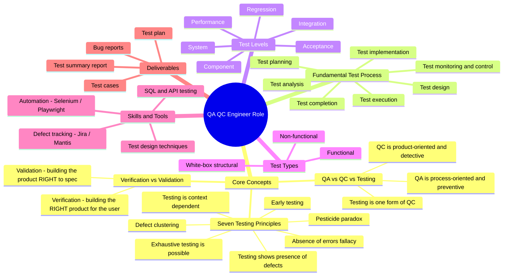
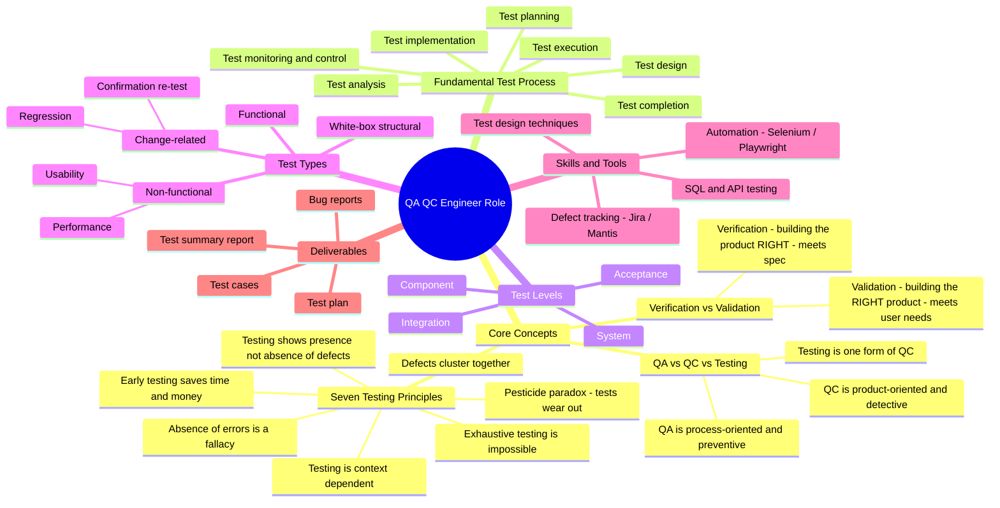

<link rel="stylesheet" href="./pdf-style.css">

# Requirement 1 (G9.1) – QA/QC Role Mindmap & AI Mistake Analysis

**CLO G9.1 — Understand:** *Ask an AI Tool for an ISTQB-process / QA-QC role mindmap, then find 3 mistakes and correct them.*

**AI provenance (log this entry in Appendix A — Prompt Log):**

| Item | Content |
|---|---|
| **Tool** | Claude (Opus 4.x) |
| **Timestamp** | `HH:MM dd/mm/2026` *(fill in the real time you ran it)* |
| **Prompt** | *"Draw a mindmap of the QA/QC tester role based on the ISTQB Foundation syllabus — include core concepts (QA vs QC, verification vs validation, the seven testing principles), the fundamental test process, test levels, test types, skills/tools, and deliverables. Output it as a Mermaid mindmap."* |

> The AI-generated mindmap below (**v1**) is reproduced **exactly as the AI produced it**, including its errors. The three mistakes I found are analysed in §3, and the corrected mindmap is in §4.

---

## 1. AI-Generated Mindmap — v1 (contains mistakes)



**Outline fallback (same content, in case Mermaid is not rendered):**

- **QA QC Engineer Role**
  - Core Concepts
    - QA vs QC vs Testing — QA = process/preventive; QC = product/detective; Testing = a form of QC
    - **Verification vs Validation** — *Verification = building the RIGHT product for the user; Validation = building the product RIGHT to spec*  ← ❌
    - Seven Testing Principles — presence of defects · **exhaustive testing is possible** ← ❌ · early testing · defect clustering · pesticide paradox · context dependent · absence-of-errors fallacy
  - Fundamental Test Process — planning · monitoring & control · analysis · design · implementation · execution · completion
  - **Test Levels** — Component · Integration · System · Acceptance · **Regression · Performance** ← ❌
  - Test Types — Functional · Non-functional · White-box
  - Skills & Tools — test design techniques · Jira/Mantis · Selenium/Playwright · SQL & API
  - Deliverables — test plan · test cases · bug reports · test summary report

---

## 2. Summary of the 3 Mistakes Found

| # | Where | The AI's claim | Verdict |
|---|---|---|---|
| 1 | Core Concepts → Verification vs Validation | Definitions are **swapped** | ❌ Incorrect |
| 2 | Seven Testing Principles | *"Exhaustive testing is possible"* | ❌ Incorrect |
| 3 | Test Levels | Lists **Regression** and **Performance** as test *levels* | ❌ Incorrect (wrong category) |

---

## 3. Detailed Mistake Analysis (ISTQB-grounded)

### Mistake 1 — Verification and Validation are swapped
- **AI said:** Verification = "building the *right* product for the user"; Validation = "building the product *right* to spec."
- **Why it's wrong (ISTQB CTFL / ISTQB Glossary):** It is the reverse.
  - **Verification** = confirmation that *specified requirements have been fulfilled* → **"Are we building the product right?"** (conformance to spec; e.g., reviews, static analysis, checking design against requirements).
  - **Validation** = confirmation that *requirements for the intended use are fulfilled* → **"Are we building the right product?"** (does it meet the user's real needs; e.g., acceptance testing).
- **Correction:** Swap the two definitions (applied in v2).

### Mistake 2 — "Exhaustive testing is possible"
- **AI said:** Listed *"exhaustive testing is possible"* as a testing principle.
- **Why it's wrong (ISTQB CTFL §1.3 — The Seven Testing Principles, Principle 2):** The principle is **"Exhaustive testing is impossible."** Testing every combination of inputs and preconditions is not feasible except for trivial cases; instead we use **risk analysis, test techniques, and prioritisation** to focus effort. (This also pairs with Principle 1: *"Testing shows the presence of defects, not their absence"* — testing can never prove software is defect-free.)
- **Correction:** Replace with **"Exhaustive testing is impossible"** (applied in v2).

### Mistake 3 — Regression and Performance listed as Test Levels
- **AI said:** Put **Regression** and **Performance** under **Test Levels**, alongside Component/Integration/System/Acceptance.
- **Why it's wrong (ISTQB CTFL §2.2 Test Levels vs §2.3 Test Types):**
  - **Test levels** are groups of activities tied to stages of development: **Component, Integration, System, Acceptance.** Regression and Performance are *not* levels.
  - **Regression testing** is **change-related testing** — a **test type** (run at any level after a change).
  - **Performance testing** is a **non-functional** — a **test type** (also run at any level).
- **Correction:** Remove both from Test Levels; place **Regression** under Test Types → Change-related, and **Performance** under Test Types → Non-functional (applied in v2).

---

## 4. Corrected Mindmap — v2



**The three fixes in v2:**
1. Verification/Validation definitions corrected (no longer swapped).
2. "Exhaustive testing is **impossible**" (Principle 2 restored); Principle 1 reworded to "presence **not absence**."
3. Regression → Test Types ▸ Change-related; Performance → Test Types ▸ Non-functional. Test Levels now correctly contains only Component / Integration / System / Acceptance.

---

## 5. How to export this for submission
- The mindmap is already in **Markdown** (accepted by the brief). To also submit a **PNG**: paste either ```mermaid``` block into <https://mermaid.live>, then **Export → PNG**, and save as `images/qaqc-mindmap.png`.
- Carry the §3 analysis into your **AI Audit Report `[AI-02]`** as one artifact entry (Verdict = *INVALID — 3 ISTQB errors*; Student fix = v2 mindmap).
