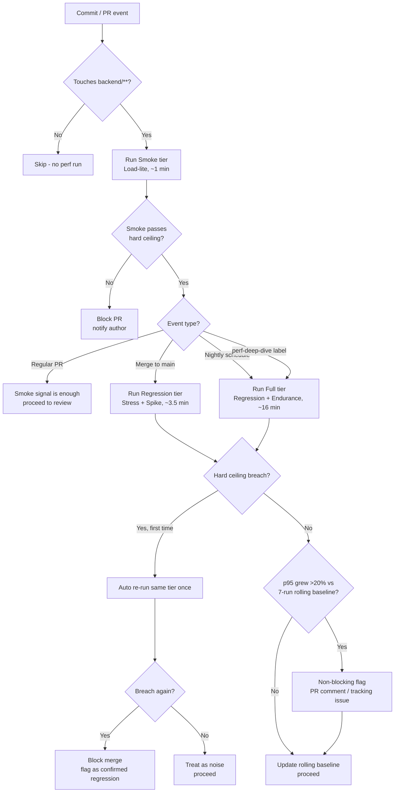

# Task 3 — Continuous Performance Testing Proposal (23127244)

## Goal

Watch commits to the SUT (`eshop-sut`), decide whether a performance run is warranted, execute the
right tier of test, and flag p95 regressions automatically — without either (a) running the full
12+ minute suite on every commit (too slow, too expensive) or (b) only testing at release time
(too late to cheaply fix a regression).

This builds directly on what HW05 actually measured, not a generic template:

- **Absolute ceilings** come from Task 2's proposed CI gates (`reports/AI-Log-Analysis.md` §7),
  themselves independently verified in `reports/AI-Misinterpretation-Hunt.md`.
- **The three-tier structure below exists because of a real finding**: `GET /api/products/:id`
  showed no meaningful limit in any test we ran, while `POST /api/forgot-password` collapses
  between 150→400 VU (SQLite single-writer lock) and needs the full 12-minute Endurance run to
  confirm 150 VU is genuinely stable, not just clean for 30 seconds. A model that treats every
  endpoint identically would either waste CI time re-proving Load is fine, or under-test the
  endpoint that actually has a cliff.

## Decision model: when to run what

| Trigger | Tier run | Rationale |
|---|---|---|
| PR touches only docs/frontend, no `backend/**` changes | **Skip** | Nothing that could regress backend performance changed |
| PR touches `backend/**` (any commit) | **Smoke** (Load-lite: 30 VU / 60s, `GET /api/products/:id` only) | Cheap (~1 min), catches an obvious regression (e.g. an accidentally-added synchronous file read) before it reaches a reviewer |
| Merge to `main` | **Regression tier** (Stress + Spike, full staged design, ~3.5 min combined) | These are the two scenarios with demonstrated real breaking points (§5 of `AI-Log-Analysis.md`) — worth re-verifying on every merge, still cheap enough to not block velocity |
| Nightly schedule (once/day) | **Full tier** (Regression tier + Endurance, ~16 min total) | Endurance's whole value is a *sustained* window — its 12-minute cost only pays off at low frequency; nightly is enough to catch a slow leak within a day, not fast enough to justify on every merge |
| Manual trigger (PR label `perf-deep-dive`) | **Full tier** | Escape hatch for a dev who suspects a regression before merge, without forcing that cost onto everyone else's PRs |

## Flagging regressions

Two distinct checks, not one, because a single absolute threshold either has too little margin
(flags CI noise) or too much (misses a real but gradual regression):

1. **Hard ceiling** — the absolute Task 2 gates (e.g. Stress p95 ≤100ms at ≤150 VU, Spike spike-stage
   error rate ≤1%). Breaching this **blocks the merge**. These already have 1.5-2x margin built in
   over the observed clean values, so a breach here is a real regression, not noise.
2. **Rolling-baseline drift** — compare this run's p95 against the median of the last 7 successful
   runs on `main` for the same scenario. If it's grown >20%, **flag but don't block** — post a PR
   comment / open a tracking issue. This is what catches "each of the last 5 merges made things
   3% slower and now we're 20% worse" — a trend no single-run ceiling would ever trip.

A run must **breach twice in a row** (this run *and* the previous one) before the hard-ceiling
check blocks anything — a single-run breach re-triggers the same tier once, automatically, before
flagging for real. This absorbs one-off CI-runner noise (a neighbor process stealing CPU, a slow
disk that day) without needing a human to manually re-run and without silently ignoring a real
regression that persists.

## Flow chart

## Trade-offs (cost vs. false alarms)

**Cost.** The Endurance test alone costs 12 real minutes per run (confirmed empirically in
`reports/Endurance-Threshold.md`) — running the full tier on every commit would be both slow
(blocking every PR for 15+ minutes) and expensive (sustained 150 VU load is real CPU/DB work, not
free CI minutes). The tiered model spends that cost only where it pays off: nightly, where a day's
latency to detect a slow leak is an acceptable trade for not paying the cost 50+ times a day across
active PRs. The cheaper Smoke tier is what actually protects PR velocity, at the cost of only
catching Load-shaped regressions before merge — a regression specific to the Stress/Spike
endpoints could still land and only get caught at the next merge-to-main run, not before.

**False alarms.** Performance signals are inherently noisier than functional test pass/fail —
shared CI runners have variable background load, and a single unlucky run can produce a spurious
breach. The double-check-before-blocking rule (§Flagging regressions) directly trades a small
amount of detection latency (a real regression takes one extra run, ~1-16 minutes depending on
tier, to confirm) for a large reduction in false positives blocking legitimate merges — the
alternative (block on any single breach) would very likely have produced false blocks during our
own HW05 runs, where Stress's Stage 4 p95 varied noticeably run-to-run even within a single test
(§5 of `AI-Log-Analysis.md` shows p95=691ms as the aggregate but 802ms was the actual p99, i.e.
real variance exists even within one clean run).

**Missed regressions.** The flip side of avoiding false alarms is the risk of a real regression
being dismissed as "just noise" if it happens to only breach once before self-correcting on the
re-run (e.g. a regression that's borderline rather than dramatic). The rolling-baseline trend
check is the mitigation for exactly this case — even a regression too small to trip the hard
ceiling twice in a row will still show up as a slow upward drift in the 7-run rolling median and
get flagged, just as a warning instead of a block. This is a deliberate choice to accept a
non-blocking warning (with human triage cost) rather than either silently missing a real slow
regression, or hard-blocking merges on noisy single-run data.

**Maintenance cost, not just compute cost.** A rolling baseline needs storage (7+ runs of
historical results per scenario) and someone has to actually triage the non-blocking flags — an
automated system that raises warnings nobody reads is no better than no system at all. This is a
real, ongoing cost the "cheap CI minutes" framing alone doesn't capture, and is arguably the
biggest reason a smaller team might reasonably choose a lighter-weight version of this model
(e.g. nightly-only, no PR-level smoke tier) rather than the full tiered design above.
