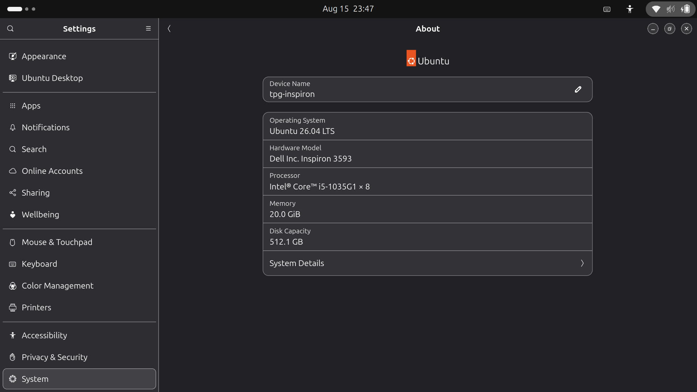

# Hardware Report — 23127244

One-time, whole-assignment evidence (Section 6 Task 1; Section 11 anti-cheat; Section 14 zip contents).

## Spec table

| Component | Value |
|---|---|
| Hostname | `tpg-inspiron` |
| Model | Dell Inspiron 3593 |
| CPU | Intel(R) Core(TM) i5-1035G1 @ 1.00GHz (4 cores / 8 threads, up to 3.6GHz) |
| RAM | 20.0 GiB (physical total; ~18 GiB available to the OS after reserved memory) |
| Disk | 512.1 GB total capacity (118 GB root partition, 64 GB free at time of report) |
| OS | Ubuntu 26.04 LTS, kernel 7.0.0-29-generic |

## Screenshot

GNOME Settings → About, showing hostname `tpg-inspiron`, matching the spec table above.
