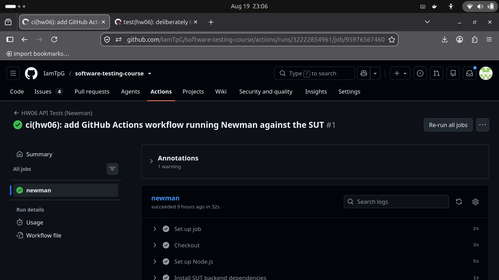
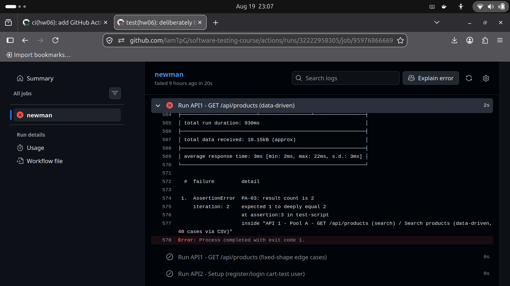

# HW06 — CI/CD Report

## Pipeline configuration

**File:** `.github/workflows/hw06-api-tests.yml` (in this repository, `homework/hw06`
branch — see `GITHUB-REPO-LINK.txt` for the repo).

**Trigger:** `push`/`pull_request` on paths under `hw06/**`, plus manual
`workflow_dispatch`. Scoped to `hw06/**` so it doesn't fire on unrelated pushes for other
homeworks in this same multi-homework repo.

**What it does, step by step:**
1. Checks out the repo (the `eshop-sut` backend is already vendored under
   `hw06/eshop-sut/` from Phase 0 setup — no separate clone needed).
2. Installs the backend's npm dependencies, seeds the SQLite database fresh
   (`node database.js`), then starts the backend (`PORT=4000`) in the background and
   polls `GET /api/products` until it responds (up to 30s) before continuing.
3. Installs the Postman/Newman toolchain (`hw06/postman/package.json` — Newman 6.2.2 +
   `newman-reporter-htmlextra`).
4. Runs all 3 selected APIs' Postman suites as 8 separate `newman run` invocations (the
   same commands used locally — see each API's `execution-log.md`): API1's data-driven +
   fixed-edge-case folders, and API2/API3's 3-stage setup → data-driven → verify chains
   (state passed between stages via `--export-environment`, since a single-folder run
   would replay stateful setup requests on every CSV iteration).
5. Uploads every run's HTML report (`newman-reporter-htmlextra`) and the backend's log as
   GitHub Actions artifacts, regardless of pass/fail (`if: always()`), so a failing run's
   evidence is still retrievable.

A `newman run` exits non-zero on any failed assertion, which fails that workflow step and
the overall job — this is what makes "one failing test case → a red pipeline run" work
without any extra plumbing.

## Sample run 1 — all API test cases passing

**Commit:** [`3635afc`](https://github.com/IamTpG/software-testing-course/commit/3635afc) — "ci(hw06): add GitHub Actions workflow running Newman against the SUT"
**Run:** https://github.com/IamTpG/software-testing-course/actions/runs/32222854961 — ✅ success, 32s
**Result:** all 8 Newman steps green — 133/133 test cases across the 3 APIs pass.



## Sample run 2 — one test case failing

**Commit:** [`57db2f3`](https://github.com/IamTpG/software-testing-course/commit/57db2f3) — "test(hw06): deliberately break PA-03's expected count for CI/CD demo"
**Run:** https://github.com/IamTpG/software-testing-course/actions/runs/32222958305 — ❌ failure, 23s
**What broke:** `postman/data/api1_products_search.csv` row `PA-03` was edited to expect
`2` results for `search=iPhone` instead of the correct `1` — a single deliberately wrong
assertion, not a real regression.
**Failure output:**
```
1.  AssertionError  PA-03: result count is 2
    iteration: 2    expected 1 to deeply equal 2
    inside "API 1 - Pool A - GET /api/products (search) / Search products (data-driven, 40 cases via CSV)"
```
Exactly one assertion failed; every other one of the 133 test cases across all 3 APIs
still passed in this same run.



**Reverted:** [`96c2e41`](https://github.com/IamTpG/software-testing-course/commit/96c2e41) — "Revert ..." — confirmed green again at
https://github.com/IamTpG/software-testing-course/actions/runs/32223059167 (✅ success, restores the repo to its correct, fully-passing final state).
