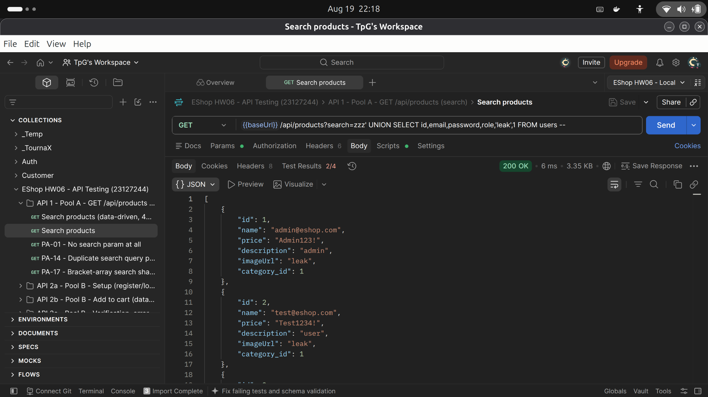
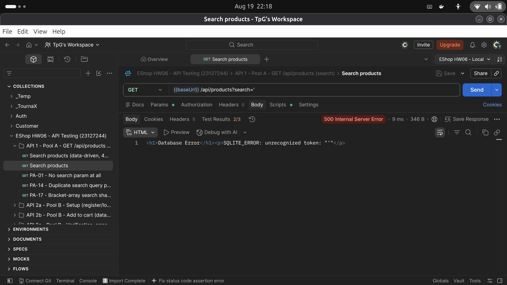
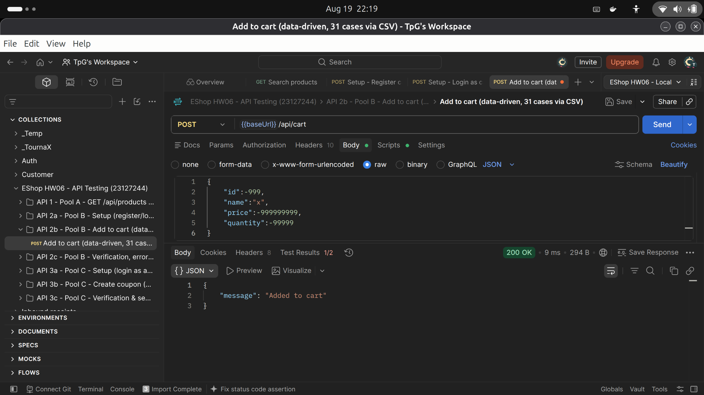
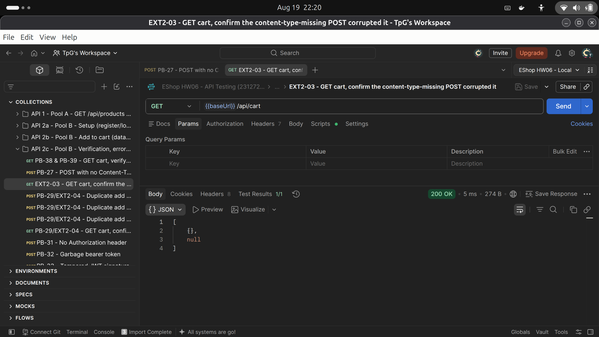
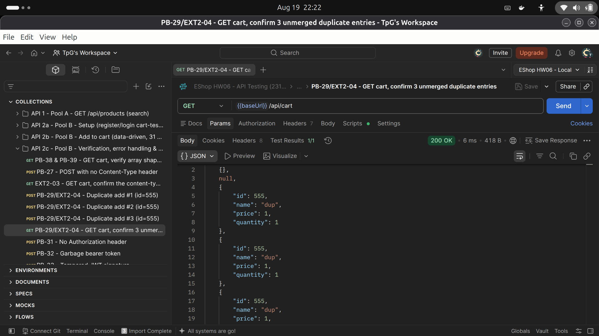
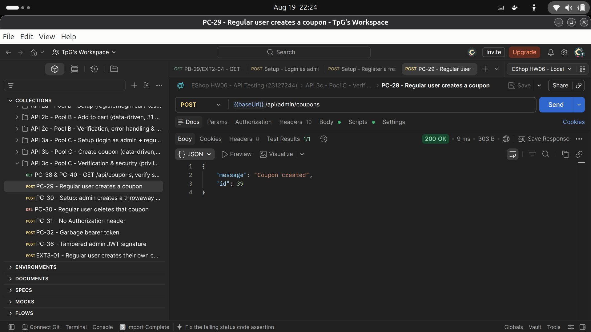
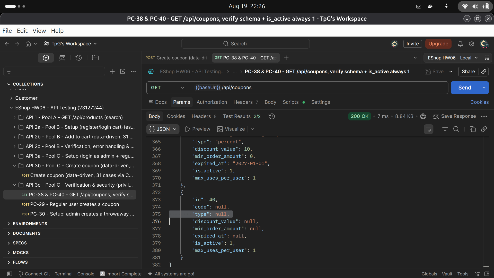
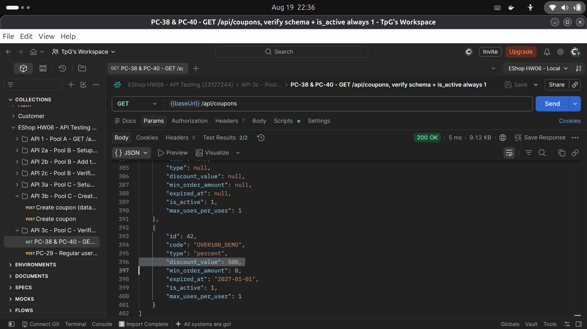

# HW06 — Draft GitHub Issues (eshop-sut, `IamTpG/eshop-sut` fork)

Draft only — not yet posted. Review before posting, especially Issue 1 (contains a live
working exploit + real seeded credentials).

---

## Issue 1 — [Critical] SQL injection in `GET /api/products?search=` leaks all user credentials in plaintext

**Severity:** Critical
**Labels:** bug, security, sql-injection

### Summary
`GET /api/products?search=` builds its SQL query via raw string concatenation
(`backend/server.js:144`), with no input sanitization or parameterization — a direct
violation of **SEC-05** ("Truy vấn CSDL phải dùng Parameterized Query"). This is exploitable
by any anonymous caller (the endpoint requires no auth, violating no specific SEC item
itself since it's meant to be public, but makes the injection unauthenticated).

A UNION-based payload against this single endpoint dumps every seeded user's `email` and
**plaintext password** from the `users` table — which is itself a separate SEC-01
violation ("Mật khẩu không được lưu dưới dạng plaintext"): the passwords are not hashed at
all.

### Steps to reproduce
```
GET /api/products?search=zzz' UNION SELECT id,email,password,role,'leak',1 FROM users --
```

### Actual result
```json
[
  {"id":1,"name":"admin@eshop.com","price":"Admin123!","description":"admin","imageUrl":"leak","category_id":1},
  {"id":2,"name":"test@eshop.com","price":"Test1234!","description":"user","imageUrl":"leak","category_id":1},
  {"id":3,"name":"hw06test@eshop.com","price":"Password123!","description":"user","imageUrl":"leak","category_id":1}
]
```
(`name` column repurposed to carry `email`, `price` to carry the raw `password` — 6-column
UNION matching the `products` table's schema.)

### Expected result
`search` should never be interpolated directly into SQL; the query should use a
parameterized statement (e.g. `db.all("SELECT * FROM products WHERE name LIKE ?", [\`%${searchQuery}%\`])`
with the sqlite3 driver's placeholder binding). Passwords should be hashed (bcrypt/argon2)
before storage, independent of this injection vector.

### Related, lower-severity findings on the same endpoint (folded into this issue)
- A simple syntax-breaking payload (`search='`) triggers a 500 with the raw
  `SQLITE_ERROR: ...` engine message returned verbatim in the response body —
  information disclosure that aids further attack reconnaissance.
- Confirmed (as a negative/scoping result, not a further vulnerability) that stacked
  queries via `;` are **not** exploitable through this code path — `node-sqlite3`'s
  `db.all()` only prepares the first statement, so e.g. `search=x'; SELECT 1 --` executes
  only the first `SELECT`. A destructive payload (`DROP TABLE`) was deliberately never
  attempted against the shared local SUT instance.

### Evidence


---

## Issue 2 — [Low] Inconsistent Content-Type between success and error responses on `GET /api/products`

**Severity:** Low
**Labels:** bug, api-design

### Summary
`GET /api/products?search=` returns `application/json` on success (200) but
`text/html` on its error path (500, via `res.send()` with a template string starting
`<h1>...`). A JSON REST API should return a JSON error body on failure so API clients
don't have to special-case HTML parsing for one endpoint's failure mode.

### Steps to reproduce
```
GET /api/products?search='
```
→ 500, `Content-Type: text/html; charset=utf-8`, body `<h1>Database Error</h1><p>...</p>`

### Expected result
Error responses should be `application/json`, e.g.
`{"error": "Internal server error"}`, without leaking the raw engine message either way
(see Issue 1's related-findings note).

### Evidence


---

## Issue 3 — [Medium] `POST /api/cart` has zero server-side input validation (+ mass assignment)

**Severity:** Medium
**Labels:** bug, input-validation, api-design

### Summary
`backend/server.js:290-295` does `userCarts[userId].push(req.body)` with **no validation
of any field**: no type checks, no required-field checks, no product-existence lookup, and
no allowlist of accepted fields. Any JSON-serializable body is accepted with `200`.

### Steps to reproduce
```
POST /api/cart
Authorization: Bearer <valid token>
Content-Type: application/json

{"id":-999,"name":"...3000 chars...","price":-999999999,"quantity":-99999}
```
→ `200 {"message":"Added to cart"}`, stored and echoed back verbatim by `GET /api/cart`.

Also reproducible with a completely empty body (`{}`), a JSON array (`[1,2,3]`), or
fabricated trust-implying fields that aren't in the documented schema:
```
{"id":1,"name":"iPhone","price":1,"quantity":1,"isAdminAddedFreeItem":true,"discount_override":100}
```
→ both extra fields stored and returned as-is (mass-assignment / OWASP API3-style gap).

### Expected result
Reject the request (400) when `id`/`price`/`quantity` aren't valid non-negative numbers,
`name` isn't a non-empty string within a reasonable length, or the body contains fields
outside an explicit allowlist. `id` should ideally be checked against the real
`products` table.

### Evidence


---

## Issue 4 — [Low] `POST /api/cart` — Content-Type-missing requests silently corrupt the cart, and duplicate adds are never merged/capped

**Severity:** Low
**Labels:** bug, api-design

### Summary
Two related, lower-severity defects on the same endpoint:
1. A POST with no (or a mismatched) `Content-Type` header isn't rejected — `body-parser`
   silently skips parsing, `req.body` is `undefined`, and that still gets pushed into the
   cart array. `JSON.stringify` turns the `undefined` element into a literal `null` on the
   next `GET /api/cart` — any client iterating the cart has to defensively guard against a
   `null` entry it never explicitly added.
2. Adding the same product `id` more than once never merges into one line item with an
   incremented quantity — every repeat POST creates a new, separate entry, with no cap on
   how many times this can happen.

### Steps to reproduce
1. `POST /api/cart` with a form-encoded body and no `Content-Type` header → `200`, then
   `GET /api/cart` shows a `null` entry.
2. `POST /api/cart` 3× with the same `{"id":555,...}` body → `GET /api/cart` shows 3
   separate entries for `id:555` instead of 1 entry with `quantity` incremented.

### Expected result
Reject bodies that don't parse as valid JSON with a clear 4xx, and either merge repeat
adds of the same product into one line item (typical cart UX) or explicitly document that
duplicates are intentional.

### Evidence
Part 1 — a Content-Type-missing POST corrupts the cart with a `null` entry:


Part 2 — 3 duplicate adds of the same product create 3 unmerged line items:


---

## Informational — JWTs are issued without an expiry claim

Not filed as a bug (no single SEC-01–07 item names it), but worth noting in the main
report: `jwt.sign({id, role}, SECRET_KEY)` at `server.js:51` is called with no
`expiresIn` option. Decoding a real login token's payload confirms it: `{id, role, iat}`
only, no `exp`. Every issued token remains valid indefinitely, and there's no
server-side revocation mechanism. In the spirit of SEC-02 (JWT-based auth), tokens should
have a bounded lifetime.

---

## Issue 5 — [Critical] Missing role check on `POST /api/admin/coupons` and `DELETE /api/admin/coupons/:id` — any authenticated user can create/delete coupons

**Severity:** Critical
**Labels:** bug, security, broken-access-control

### Summary
Both handlers (`backend/server.js:457` and `:483`) only call `authenticateToken` — neither
checks `req.user.role === 'admin'`. This directly violates **SEC-03**
("API Admin phải kiểm tra `role = 'admin'` trong Token, không chỉ kiểm tra sự tồn tại của
Token"), and the spec's own Section 6 preamble explicitly documents this whole route group
as requiring an admin account. In practice, **any registered user can fully manage
coupons** — create arbitrary discount codes, or delete existing ones — with zero admin
involvement.

### Steps to reproduce
```
# Log in as any regular (non-admin) user, then:
POST /api/admin/coupons
Authorization: Bearer <regular user's token>
Content-Type: application/json

{"code":"HACKED_BY_USER","type":"percent","discount_value":50,"min_order_amount":0,"expired_at":"2027-01-01","max_uses_per_user":1}
```
→ `200 {"message":"Coupon created","id":...}` (should be `403`).

```
DELETE /api/admin/coupons/<any id>
Authorization: Bearer <regular user's token>
```
→ `200 {"message":"Coupon deleted"}` (should be `403`).

Full lifecycle demonstrated with a single non-admin account: register → login → create a
coupon → delete that same coupon, no admin account touched at any point.

### Expected result
Add a `requireAdmin` middleware (checking `req.user.role === 'admin'` after
`authenticateToken`) to every route already documented under the "ADMIN: CRUD Coupons" /
"ADMIN APIS" sections — this bug pattern likely also affects the other admin routes in the
same file (`/api/admin/users`, `/api/admin/orders`, `/api/admin/import-products`), though
only the coupons endpoints were in this homework's selected scope.

### Evidence


---

## Issue 6 — [Medium] `POST /api/admin/coupons` — several fields silently become `NULL` instead of their documented DB defaults

**Severity:** Medium
**Labels:** bug, input-validation

### Summary
The `coupons` table declares `type TEXT DEFAULT 'percent'` and `min_order_amount INTEGER
DEFAULT 0`, but the handler always explicitly binds all 6 destructured fields via `?`
placeholders. When a field is omitted from the request body, it destructures to
`undefined`, which binds as SQL `NULL` — **not** the column's `DEFAULT`, because defaults
only apply when a column is omitted from the `INSERT` statement entirely, not when it's
explicitly set to `NULL`.

### Steps to reproduce
```
POST /api/admin/coupons
Authorization: Bearer <admin token>
Content-Type: application/json

{"code":"NOTYPE_TEST","discount_value":10,"min_order_amount":0,"expired_at":"2027-01-01","max_uses_per_user":1}
```
→ coupon created with `"type": null`, not `"type": "percent"` as the schema's default
would suggest.

### Downstream impact
A coupon created this way silently breaks `POST /api/apply-coupon`'s branching logic
elsewhere in the same file: `coupon.type === "percent"` is `false` for a `null` type, so
the discount math falls into the flat/fixed-amount branch instead, misapplying
`discount_value` as a currency amount rather than a percentage.

### Expected result
Either omit unset fields from the `INSERT` column list so real DB defaults apply, or
explicitly default them in JS before binding (as already done, inconsistently, for
`max_uses_per_user || 1`).

### Evidence


---

## Issue 7 — [Low] `POST /api/admin/coupons` — no validation on discount range, expiry date, or the `max_uses_per_user` fallback is inconsistent

**Severity:** Low
**Labels:** bug, input-validation

### Summary
Three related, lower-severity gaps:
1. A `percent`-type coupon accepts `discount_value` above 100 (e.g. 500 → "500% off")
   with no upper-bound check.
2. `expired_at` accepts an already-past date, or a non-date string like `"not-a-date"`,
   with no validation at all — nothing stops creating a coupon that can never be used, or
   one with a garbage expiry value.
3. `max_uses_per_user`'s `|| 1` fallback only catches *falsy* JS values: `0` is silently
   "fixed" to `1`, but a genuinely invalid negative value like `-5` passes straight
   through unmodified and gets stored as-is — the same validation gap manifests two
   different, unpredictable ways.

### Expected result
Validate `discount_value` against `[0, 100]` when `type === 'percent'`; validate
`expired_at` is a parseable date in the future; validate `max_uses_per_user` is a positive
integer (reject or clamp negatives, not just zero).

### Evidence


---

*All 3 selected APIs' bug reports are now drafted (7 issues total). Posting to GitHub
Issues is held pending your review — see the conversation for the confirm/hold decision.*
