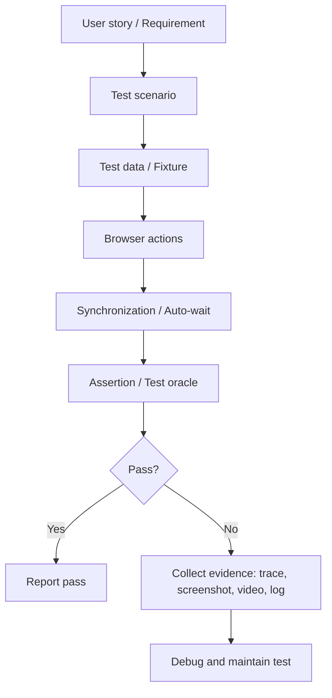

# T02 - Đề xuất công cụ cho Seminar Web Automation Testing

> **Môn học:** CS423 / CSC15003 - Software Testing  
> **Đề tài:** T02 - Web Automation Testing  
> **SUT dự kiến:** EShop - <https://github.com/ttbhanh/eshop-sut>  
> **Thời gian nghiên cứu đề xuất:** 05/07/2026 - 12/07/2026  
> **Mục đích tài liệu:** Trình bày hướng nghiên cứu và đề xuất công cụ để xin giảng viên/TA duyệt trước khi nhóm bước sang giai đoạn cài đặt, demo và soạn user guide.

---

## 1. Tóm tắt đề xuất

Nhóm đề xuất lấy **Playwright (TypeScript)** làm công cụ Web Automation Testing chính cho seminar T02, kết hợp **GitHub Copilot** làm lớp AI-augmented để hỗ trợ sinh test draft, gợi ý locator/assertion và review code. Nếu điều kiện tài khoản cho phép, nhóm sẽ dùng **Testim AI hoặc mabl** làm đối chứng AI-native/self-healing trong phần so sánh.

Hướng đề xuất này không kết luận Playwright là công cụ tốt nhất trong mọi bối cảnh. Kết luận được giới hạn trong bối cảnh:

- seminar 45 phút;
- activity trên lớp tối đa 25 phút;
- SUT là EShop với các flow web end-to-end;
- thành viên cần cài đặt và chạy lại được trên máy cá nhân;
- báo cáo cần minh họa rõ lý thuyết automation, flakiness, locator, evidence và rủi ro AI.

---

## 2. Căn cứ từ brief và file HTML đề xuất

Từ `Seminar_Workflow_Briefing.pdf` và file `seminar-web-automation-testing.html`, nhóm xác định các yêu cầu chính:

| Nhóm yêu cầu | Nội dung cần đáp ứng |
|---|---|
| Stage S1 | Có `Tool_Survey_Proposal.md` hoặc tài liệu tương đương để biện minh chọn công cụ |
| Stage S2 | Cần được giảng viên/TA review và chấp thuận công cụ trước khi triển khai sau |
| Demo | Cần thể hiện ít nhất một công cụ automation truyền thống và một yếu tố AI |
| SUT | EShop, ưu tiên các flow web có tính nghiệp vụ rõ |
| Flow đề xuất | Login/lockout, Add-to-Cart, Checkout |
| Nội dung lý thuyết | Locator, synchronization, assertion, fixture/test data, maintainability, flakiness, CI/CD, reporting/evidence |
| User guide | Bắt buộc có mục failure modes và ít nhất 3 cách công cụ có thể gây hiểu nhầm |
| Activity | Có thể tái lập bởi nhóm khác trong thời gian ngắn, không phụ thuộc quá nhiều vào người hướng dẫn |

Với các ràng buộc này, công cụ chính cần vừa có khả năng kỹ thuật mạnh, vừa dễ cài đặt, dễ giải thích và dễ tái lập.

---

## 3. Cơ sở lý thuyết liên quan đến kiểm thử tự động

Phần này bổ sung cơ sở lý thuyết để proposal không chỉ dừng ở việc chọn công cụ, mà còn giải thích vì sao các tiêu chí như locator, synchronization, assertion, fixture, flakiness, evidence và CI/CD là các tiêu chí bắt buộc khi đánh giá Web Automation Testing.

### 3.1. Khái niệm kiểm thử tự động

**Kiểm thử tự động** là việc dùng công cụ, script hoặc framework để thực thi các bước kiểm thử, chuẩn bị dữ liệu, quan sát kết quả và so sánh kết quả thực tế với kết quả mong đợi. Mục tiêu chính không phải là "thay thế toàn bộ tester thủ công", mà là tự động hóa các kiểm tra có tính lặp lại, có expected result rõ ràng và cần chạy nhiều lần trong quá trình phát triển phần mềm.

Trong web application, kiểm thử tự động thường mô phỏng hành vi người dùng trên trình duyệt: mở trang, nhập form, click nút, kiểm tra nội dung hiển thị, kiểm tra trạng thái giỏ hàng, kiểm tra đơn hàng hoặc kiểm tra thông báo lỗi. Với đề tài T02, phần trọng tâm là **web UI end-to-end automation**, nhưng nhóm vẫn cần đặt nó trong chiến lược kiểm thử tổng thể để tránh hiểu nhầm rằng càng nhiều test UI càng tốt.

Các lợi ích chính:

- **Tăng khả năng lặp lại:** cùng một kịch bản có thể chạy nhiều lần với cùng điều kiện.
- **Rút ngắn feedback loop:** lỗi hồi quy được phát hiện nhanh hơn sau mỗi thay đổi.
- **Tăng độ bao phủ hồi quy:** các flow quan trọng như login, add-to-cart, checkout có thể được kiểm tra thường xuyên.
- **Tạo bằng chứng khi lỗi xảy ra:** report, screenshot, video, trace và log giúp phân tích nguyên nhân fail.
- **Hỗ trợ CI/CD:** test có thể chạy tự động trong pipeline trước khi merge/deploy.

Các giới hạn cần nêu rõ:

- Không phải mọi test case đều nên tự động hóa.
- Automation không thay thế exploratory testing, usability testing hoặc đánh giá cảm nhận người dùng.
- Test tự động vẫn có thể sai nếu test oracle, dữ liệu test hoặc assertion được thiết kế kém.
- Test tự động có chi phí bảo trì, đặc biệt với web UI thường xuyên thay đổi.

### 3.2. Vị trí của web automation trong chiến lược kiểm thử

Một chiến lược kiểm thử tốt thường có nhiều tầng:

| Tầng kiểm thử | Mục tiêu | Đặc điểm |
|---|---|---|
| Unit test | Kiểm tra hàm/class/module nhỏ | Nhanh, rẻ, dễ chạy nhiều |
| Integration/API test | Kiểm tra tương tác giữa module hoặc service | Cân bằng giữa tốc độ và độ tin cậy |
| UI/E2E test | Kiểm tra luồng người dùng từ giao diện đến backend | Gần thực tế người dùng nhưng chậm và dễ flaky hơn |
| Manual/exploratory test | Khám phá rủi ro, UX, trường hợp khó định nghĩa oracle | Linh hoạt, phụ thuộc kinh nghiệm tester |

Mô hình "test pyramid" nhắc nhóm rằng UI/E2E test nên tập trung vào các flow nghiệp vụ quan trọng thay vì bao phủ mọi chi tiết giao diện. Với EShop, nhóm chọn Login/lockout, Add-to-Cart và Checkout vì đây là các luồng có giá trị nghiệp vụ cao, expected result rõ, dễ giải thích trong demo và đủ đại diện cho rủi ro web automation.

### 3.3. Thành phần của một ca kiểm thử tự động

Một test tự động có chất lượng cần đủ các thành phần sau:

| Thành phần | Ý nghĩa | Ví dụ với EShop |
|---|---|---|
| Precondition | Điều kiện trước khi chạy test | User đã tồn tại, sản phẩm còn hàng |
| Test data/fixture | Dữ liệu đầu vào được kiểm soát | Tài khoản demo, sản phẩm mẫu, địa chỉ giao hàng |
| Action | Các bước mô phỏng người dùng | Login, chọn sản phẩm, thêm vào giỏ, checkout |
| Synchronization | Chờ đúng điều kiện thay vì hard wait | Chờ nút enabled, chờ cart badge cập nhật |
| Assertion/test oracle | Cơ chế xác định pass/fail | Cart có đúng sản phẩm, tổng tiền đúng, thông báo thành công xuất hiện |
| Cleanup/teardown | Dọn dữ liệu hoặc reset trạng thái | Xóa cart, reset account, đóng browser context |
| Evidence | Bằng chứng khi chạy test | HTML report, screenshot, video, Playwright trace |

Điểm quan trọng là test tự động không chỉ "click được" mà phải kiểm tra kết quả nghiệp vụ. Một test Add-to-Cart chỉ click nút và assert nút còn visible là chưa đủ; test cần kiểm tra giỏ hàng thật sự tăng số lượng hoặc có đúng sản phẩm.

### 3.4. Các khái niệm cốt lõi trong Web Automation Testing

| Khái niệm | Nội dung lý thuyết | Cách áp dụng trong đề tài |
|---|---|---|
| Locator strategy | Cách xác định element trên trang. Locator tốt nên gần với cách người dùng hoặc accessibility tree nhìn thấy UI, ít phụ thuộc vị trí DOM. | Ưu tiên `getByRole`, `getByLabel`, `getByText`, `getByTestId`; hạn chế XPath/CSS dài theo vị trí. |
| Synchronization | Web UI có render bất đồng bộ, request mạng, animation và cập nhật DOM. Test cần chờ trạng thái đúng, không chờ theo thời gian cố định. | Dùng auto-wait và web-first assertion của Playwright; tránh `sleep`/hard wait. |
| Assertion/test oracle | Oracle quyết định test pass/fail. Assertion quá lỏng gây false pass, assertion quá chặt gây false fail. | Viết expected result trước; kiểm tra nội dung nghiệp vụ như cart count, order status, error message. |
| Test data/fixture | Test cần dữ liệu ổn định, độc lập, có thể reset. Dữ liệu dùng chung không kiểm soát dễ gây fail ngẫu nhiên. | Chuẩn bị account demo, sản phẩm mẫu, fixture cho login/cart/checkout. |
| Test isolation | Mỗi test nên ít phụ thuộc thứ tự chạy hoặc trạng thái test khác. | Tạo browser context riêng; setup/teardown cart trước hoặc sau test. |
| Maintainability | Test code cần dễ đọc, ít trùng lặp, dễ sửa khi UI thay đổi hợp lý. | Dùng Page Object hoặc helper cho login, cart, checkout; tách locator dùng lại. |
| Flakiness | Test flaky là test có thể pass/fail không ổn định dù code ứng dụng không đổi. Nguyên nhân thường là timing, network, dữ liệu chia sẻ, selector mong manh hoặc môi trường. | Chạy lặp test, ghi nhận nguyên nhân fail, dùng trace viewer để phân tích. |
| Reporting/evidence | Test automation phải để lại bằng chứng đủ để debug. Nếu fail mà không biết fail ở đâu thì giá trị automation giảm mạnh. | Lưu HTML report, screenshot, video, trace zip, log terminal. |
| CI/CD integration | Test tự động có giá trị cao khi được chạy thường xuyên trong pipeline. | Cung cấp script CLI, cấu hình Playwright và gợi ý GitHub Actions. |
| AI augmentation | AI có thể hỗ trợ sinh test draft, gợi ý locator và refactor, nhưng không tự bảo đảm đúng nghiệp vụ. | Dùng Copilot như trợ lý; con người review locator, assertion và expected result. |

### 3.5. Tiêu chí chọn test case để tự động hóa

Nhóm chỉ nên tự động hóa những test case có lợi ích rõ so với chi phí bảo trì. Các test case phù hợp:

- Flow được chạy lặp lại nhiều lần trong regression.
- Flow có giá trị nghiệp vụ cao hoặc rủi ro lỗi cao.
- Expected result rõ, có thể assert bằng dữ liệu hoặc trạng thái UI.
- Dữ liệu test có thể chuẩn bị và reset được.
- UI tương đối ổn định hoặc có locator ổn định.
- Test có thể chạy trong thời gian chấp nhận được trên máy local hoặc CI.

Các test case chưa nên tự động hóa trong phạm vi seminar:

- Test chỉ chạy một lần hoặc không có giá trị hồi quy.
- Test phụ thuộc đánh giá cảm tính như giao diện đẹp/xấu.
- Test có expected result chưa rõ hoặc yêu cầu quan sát thủ công phức tạp.
- Test phụ thuộc dịch vụ ngoài khó kiểm soát, quota hoặc tài khoản thật.
- Test UI đang thay đổi liên tục làm chi phí bảo trì vượt lợi ích.

### 3.6. Rủi ro thường gặp khi làm kiểm thử tự động web

| Rủi ro | Nguyên nhân | Hậu quả | Cách kiểm soát |
|---|---|---|---|
| Flaky test | Timing, network, async UI, dữ liệu chia sẻ | Mất niềm tin vào test suite | Auto-wait, test isolation, chạy lặp, trace khi fail |
| Brittle locator | Chọn CSS/XPath theo vị trí DOM | Test fail khi UI đổi nhỏ | Ưu tiên role/label/test-id, review locator |
| False pass | Assertion quá lỏng hoặc self-healing chọn nhầm element | Bug thật bị che giấu | Viết oracle theo requirement, xem evidence, không tin pass mù quáng |
| False fail | Assertion quá chặt hoặc dữ liệu không ổn định | Tốn thời gian debug test không phải bug | Kiểm soát fixture, tránh assert chi tiết không quan trọng |
| Test chậm | Quá nhiều E2E hoặc setup nặng | Pipeline lâu, ít người chạy test | Chọn flow đại diện, chạy song song, ưu tiên API/unit cho logic nhỏ |
| Khó bảo trì | Copy-paste steps, thiếu helper/Page Object | Mỗi thay đổi UI phải sửa nhiều nơi | Tách helper, đặt tên test rõ, review cấu trúc test code |

### 3.7. Vai trò của AI trong kiểm thử tự động

Trong đề tài này, AI được xem là lớp hỗ trợ, không phải là nguồn quyết định đúng/sai của test. Có hai nhóm vai trò chính:

| Nhóm AI | Vai trò | Lợi ích | Rủi ro |
|---|---|---|---|
| AI coding assistant | Gợi ý test draft, locator, assertion, refactor code | Tăng tốc viết test và học API công cụ | Có thể sinh locator mong manh, assertion thiếu nghiệp vụ, code không chạy |
| AI-native/self-healing tool | Tự tìm lại element khi locator cũ gãy, hỗ trợ root cause/evidence | Giảm nhiễu do thay đổi UI nhỏ | Có thể "chữa" sai và tạo false pass nếu UI đổi do bug |

Do đó, thông điệp seminar cần nhấn mạnh:

- AI giúp tăng tốc tạo và bảo trì test, nhưng con người vẫn phải xác định requirement, test oracle và risk.
- Mọi output AI phải được chạy thật, review diff và đối chiếu evidence.
- Self-healing chỉ nên được xem là tín hiệu hỗ trợ bảo trì, không phải lý do bỏ qua review lỗi UI.
- Khi demo AI, nhóm cần chỉ rõ phần nào do AI gợi ý, phần nào do nhóm chỉnh sửa và vì sao.

### 3.8. Liên hệ lý thuyết với lựa chọn Playwright

Các khái niệm trên dẫn trực tiếp đến lý do chọn Playwright làm công cụ chính:

| Nhu cầu lý thuyết | Khả năng của Playwright | Ý nghĩa trong seminar |
|---|---|---|
| Locator ổn định | Locator theo role, label, text, test id | Dễ minh họa best practice locator |
| Synchronization tốt | Auto-wait, actionability check, assertion retry | Giảm hard wait và race condition |
| Evidence khi fail | HTML report, screenshot, video, trace viewer | Dễ debug và dễ quay video demo |
| Test isolation | Browser context, fixture, setup/teardown | Phù hợp chạy nhiều flow EShop |
| Maintainability | TypeScript, helper, Page Object Model | Dễ tổ chức mã nguồn demo |
| CI/CD | CLI rõ, cấu hình CI chính thức | Dễ tái lập trên máy khác hoặc pipeline |

Với GitHub Copilot, nhóm dùng AI để sinh bản nháp test và so sánh với test viết tay, từ đó minh họa rõ rủi ro locator/assertion thay vì chỉ trình bày AI như một "hộp đen".

---

## 4. Tiêu chí đánh giá công cụ

Nhóm dùng hai lớp tiêu chí: tiêu chí kỹ thuật từ lý thuyết test automation và tiêu chí thực tế của seminar.

### 4.1. Tiêu chí kỹ thuật

| Mã | Tiêu chí | Lý do quan trọng |
|---|---|---|
| R1 | Browser execution | Công cụ phải điều khiển được trình duyệt và chạy được luồng E2E |
| R2 | Locator strategy | Locator phải ổn định khi DOM thay đổi nhỏ |
| R3 | Synchronization | Giảm race condition và hard wait |
| R4 | Assertion/test oracle | Test phải kiểm tra đúng kết quả nghiệp vụ, không chỉ kiểm tra click được |
| R5 | Test data/fixture | Mỗi lần chạy cần độc lập, có setup/teardown rõ |
| R6 | Maintainability | Hỗ trợ Page Object/helper để giảm duplication |
| R7 | Cross-browser/parallel/repeat | Hỗ trợ chạy lại, chạy nhiều browser hoặc chạy song song khi cần |
| R8 | Evidence/debuggability | Khi fail phải có trace, screenshot, video, log hoặc report |
| R9 | CI/CD | Chạy được qua CLI và tích hợp pipeline |
| R10 | AI augmentation | AI có thể hỗ trợ nhưng phải audit được và không thay thế test oracle |

### 4.2. Tiêu chí trong bối cảnh seminar

| Mã | Tiêu chí | Cách đánh giá |
|---|---|---|
| S1 | Dễ cài đặt | Sinh viên có thể setup trong thời gian ngắn |
| S2 | Dễ tái lập | Máy khác có thể chạy lại mà không cần cloud/license phức tạp |
| S3 | Dễ giải thích | Công cụ giúp minh họa lý thuyết thay vì che giấu cơ chế bên dưới |
| S4 | Phù hợp activity 25 phút | Người tham gia có thể thực hiện một flow nhỏ |
| S5 | Chi phí/licence | Ưu tiên open-source/free/student access |
| S6 | Rủi ro AI | Cần nhìn thấy và kiểm soát hallucination, false positive, self-healing sai |

---

## 5. Công cụ được khảo sát

### 5.1. Nhóm framework truyền thống

| Công cụ | Điểm mạnh | Giới hạn trong seminar |
|---|---|---|
| Playwright | Auto-wait, locator hiện đại, assertion retry, trace viewer, multi-browser, parallel, CI tốt | Cần viết code, learning curve trung bình |
| Cypress | Thân thiện với frontend, retry-ability tốt, debug trực quan, best practice locator `data-*` rõ | Một số điểm mang tính Cypress-specific; cross-browser hẹp hơn mục tiêu của Playwright |
| Selenium 4 | Tiêu chuẩn lâu năm, ecosystem rộng, WebDriver W3C, Selenium Grid mạnh | Cần ghép runner/assertion/report riêng; setup và wait phức tạp hơn cho seminar ngắn |

### 5.2. Nhóm low-code/no-code và AI-native

| Công cụ | Điểm mạnh | Giới hạn trong seminar |
|---|---|---|
| Katalon Studio | GUI dễ tiếp cận, hỗ trợ Web/API/Mobile/Desktop, self-healing và AI self-healing | Một số tính năng cần license; có thể che giấu chi tiết kỹ thuật automation |
| Testim AI | Smart Locators, codeless authoring, TestOps, cloud grid, root cause/evidence | Phụ thuộc account/cloud/trial; khó bảo đảm mọi nhóm khác tái lập |
| mabl | Auto-heal, intelligent wait, visual/regression support, report tốt | Nặng về SaaS; advanced auto-heal phụ thuộc cloud và lịch sử run |
| Virtuoso QA | Natural language authoring, self-healing, root cause analysis, cloud execution | Thường phù hợp enterprise; phụ thuộc trial và cloud |
| ACCELQ | Nền tảng no-code/codeless AI, phù hợp enterprise stack Web/Mobile/API/Desktop | Quá rộng so với seminar T02; khó benchmark sâu trong 1 tuần nếu không có account |

### 5.3. Nhóm AI coding assistant/agent

| Công cụ | Vai trò phù hợp | Giới hạn |
|---|---|---|
| GitHub Copilot | Hỗ trợ sinh test draft, gợi ý assertion, refactor Page Object, giải thích code | Không phải test runner; code sinh ra phải review và chạy thực tế |
| OpenAI Codex | Có thể đọc repo, sửa code, chạy test/linters trong môi trường agent | Phụ thuộc quyền truy cập/tài khoản; cần kiểm soát lệnh và review diff |
| Google Antigravity | Agent-first IDE, có artifacts/screenshot/walkthrough để review | Mới và phụ thuộc preview/rate limit; không phải automation framework riêng |

---

## 6. Benchmark theo tiêu chí

Thang điểm: 1 = yếu, 2 = chấp nhận được, 3 = tốt, 4 = rất tốt, 5 = rất phù hợp với bối cảnh seminar.

| Công cụ | R1-R4 core automation | R5-R6 maintainability | R7-R9 execution/report/CI | R10 AI | Tái lập trong lớp | Tổng kết |
|---|:---:|:---:|:---:|:---:|:---:|---|
| Playwright | 5 | 5 | 5 | 3 | 5 | Đề xuất làm công cụ chính |
| Cypress | 4 | 4 | 4 | 3 | 4 | Backup truyền thống tốt |
| Selenium 4 | 4 | 3 | 4 | 1 | 3 | Tốt để so sánh lý thuyết, không tối ưu cho demo ngắn |
| Katalon Studio | 4 | 4 | 4 | 4 | 3 | Đối chứng AI/self-healing nếu license ổn |
| Testim AI | 4 | 4 | 5 | 5 | 2 | Đối chứng AI-native nếu có trial |
| mabl | 4 | 4 | 5 | 5 | 2 | Đối chứng AI-native nếu có trial |
| Virtuoso QA | 4 | 4 | 4 | 5 | 2 | Tốt về natural-language testing, nhưng phụ thuộc SaaS |
| ACCELQ | 4 | 4 | 4 | 5 | 2 | Mạnh ở enterprise, quá lớn so với phạm vi tuần đầu |
| GitHub Copilot | 2 | 3 | 2 | 5 | 4 | Lớp AI hỗ trợ, không thay thế framework |
| OpenAI Codex | 2 | 3 | 3 | 5 | 3 | Lớp AI agent backup, cần quyền và audit |
| Google Antigravity | 2 | 3 | 3 | 5 | 3 | Lớp AI agent tham khảo, chưa nên làm công cụ chính |

---

## 7. Đề xuất công cụ cụ thể

### 7.1. Công cụ chính

**Playwright (TypeScript)** được đề xuất làm framework chính vì:

1. **Bao phủ tốt R1-R9.** Playwright có test runner, locator API, auto-wait, web-first assertion, fixture, parallel execution, report, trace viewer và cấu hình CI.
2. **Giảm flaky test ngay từ thiết kế.** Auto-wait và assertion retry giúp minh họa synchronization tốt hơn so với hard wait.
3. **Evidence mạnh khi fail.** Trace viewer cho phép xem lại từng bước, DOM snapshot, network, console và error.
4. **Phù hợp activity ngắn.** Người học có thể viết một test Add-to-Cart nhỏ bằng `getByRole`/`getByTestId` và chạy bằng CLI.
5. **Dễ tái lập.** Open-source, chạy local, không bắt buộc cloud hoặc commercial trial.
6. **Gắn với lý thuyết maintainability.** Nhóm có thể triển khai Page Object Model, fixture và reusable helper để chứng minh chi phí bảo trì.

### 7.2. Công cụ AI chính

**GitHub Copilot** được đề xuất làm AI-augmented assistant vì:

1. Hỗ trợ trực tiếp việc sinh test draft từ prompt và code context.
2. Tích hợp IDE, dễ quay demo quy trình "human writes scenario -> AI drafts test -> human audits -> run test".
3. Phù hợp thông điệp seminar: AI tăng tốc nhưng không phải test oracle.
4. Có thể so sánh locator/assertion do AI gợi ý với locator/assertion do nhóm viết tay.

### 7.3. Công cụ đối chứng

Nhóm đề xuất giữ:

- **Cypress** làm backup truyền thống nếu Playwright gặp vấn đề cài đặt;
- **Testim AI hoặc mabl** làm đối chứng AI-native/self-healing nếu tài khoản trial khả thi;
- **Katalon Studio** làm đối chứng low-code nếu cần công cụ để demo self-healing trên máy local.

---

## 8. Phạm vi pilot sau khi được duyệt

Sau khi giảng viên/TA duyệt hướng công cụ, nhóm sẽ pilot 3 flow EShop:

| Flow | Mục tiêu kiểm thử | Lý do chọn |
|---|---|---|
| Login + lockout | Kiểm tra login thành công, sai mật khẩu, tài khoản bị khóa | Có nhiều nhánh và expected result rõ |
| Add-to-Cart | Kiểm tra thêm sản phẩm và cập nhật cart state | DOM động, phù hợp so locator và flaky |
| Checkout | Kiểm tra luồng đặt hàng nhiều bước | Đại diện E2E thực tế |

Mỗi flow sẽ có:

- test viết tay bằng Playwright;
- nếu khả thi, test draft do Copilot hỗ trợ;
- evidence chạy test: HTML report, screenshot/trace khi fail;
- ghi nhận locator strategy và số lần phải chỉnh output AI.

---

## 9. Rủi ro và cách kiểm soát

| Rủi ro | Ảnh hưởng | Kiểm soát |
|---|---|---|
| AI sinh locator CSS/XPath mong manh | Test fail khi DOM đổi nhỏ | Human review, ưu tiên role/label/test-id |
| AI sinh assertion quá lỏng | Test pass dù nghiệp vụ sai | Viết expected result trước, review assertion theo requirement |
| Self-healing chọn nhầm element | False pass, che giấu bug UI | Bắt buộc xem evidence, log healing và visual/screenshot |
| Công cụ SaaS hết trial/quota | Không demo được | Chọn Playwright local làm backbone; SaaS chỉ là đối chứng |
| Selenium/Katalon setup mất thời gian | Trễ activity | Chỉ dùng làm benchmark hoặc backup |
| Agent có quyền chạy lệnh/sửa file | Rủi ro thay đổi ngoài ý muốn | Chỉ dùng repo demo, review diff, không đưa secret vào prompt |

---

## 10. Kết luận xin duyệt

Nhóm xin giảng viên/TA duyệt hướng:

> **Playwright (TypeScript)** là công cụ Web Automation Testing chính; **GitHub Copilot** là AI-augmented assistant chính; **Cypress** là backup truyền thống; **Testim AI/mabl/Katalon** là đối chứng AI-native/low-code nếu điều kiện tài khoản cho phép.

Hướng này giúp nhóm:

- trình bày đầy đủ lý thuyết automation;
- có demo chạy local ổn định;
- có điểm AI đúng yêu cầu brief;
- giải thích được rủi ro AI/self-healing;
- hoàn thành activity ngắn có tính tái lập.

---

## 11. Tài liệu tham khảo

1. Playwright - Auto-waiting: <https://playwright.dev/docs/actionability>
2. Playwright - Locators: <https://playwright.dev/docs/locators>
3. Playwright - Trace Viewer: <https://playwright.dev/docs/trace-viewer-intro>
4. Playwright - Continuous Integration: <https://playwright.dev/docs/ci>
5. Cypress - Best Practices: <https://docs.cypress.io/app/core-concepts/best-practices>
6. Cypress - Retry-ability: <https://docs.cypress.io/app/core-concepts/retry-ability>
7. Cypress - Continuous Integration: <https://docs.cypress.io/app/continuous-integration/overview>
8. Selenium - WebDriver: <https://www.selenium.dev/documentation/webdriver/>
9. Selenium - Waiting Strategies: <https://www.selenium.dev/documentation/webdriver/waits/>
10. Selenium - Grid: <https://www.selenium.dev/documentation/grid/>
11. Selenium - Page Object Models: <https://www.selenium.dev/documentation/test_practices/encouraged/page_object_models/>
12. Ham Vocke - The Practical Test Pyramid: <https://martinfowler.com/articles/practical-test-pyramid.html>
13. Google Testing Blog - Just Say No to More End-to-End Tests: <https://testing.googleblog.com/2015/04/just-say-no-to-more-end-to-end-tests.html>
14. Katalon - Self-healing tests: <https://docs.katalon.com/katalon-studio/maintain-tests/self-healing-tests-in-katalon-studio>
15. Testim - Web and Mobile Testing / Smart Locators: <https://docs.tricentis.com/testim/content/overview/testim-overview/testim-automate.htm>
16. mabl - How auto-heal works: <https://help.mabl.com/hc/en-us/articles/19078583792404-How-auto-heal-works>
17. Virtuoso - Overview: <https://docs.virtuoso.qa/guide/>
18. ACCELQ - AI-powered codeless automation: <https://www.accelq.com/>
19. GitHub Copilot - Writing tests: <https://docs.github.com/en/copilot/tutorials/write-tests>
20. GitHub Copilot - Responsible use of agents: <https://docs.github.com/en/copilot/responsible-use/agents>
21. OpenAI - Introducing Codex: <https://openai.com/index/introducing-codex/>
22. Google Developers Blog - Google Antigravity: <https://developers.googleblog.com/en/build-with-google-antigravity-our-new-agentic-development-platform/>
