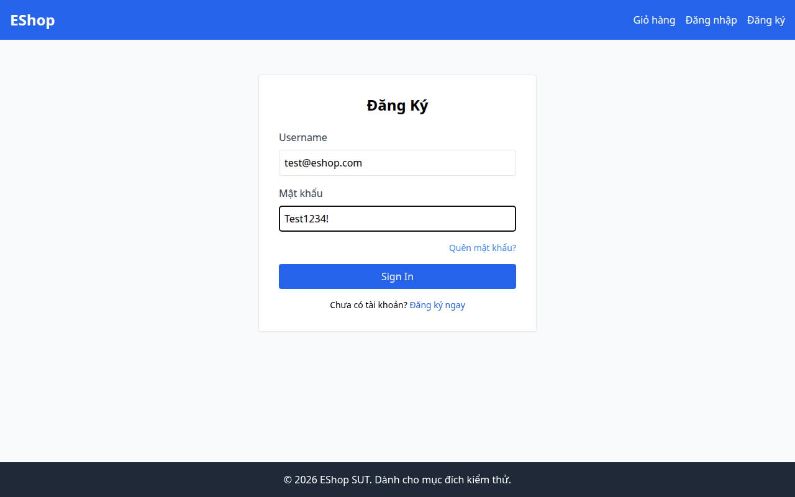
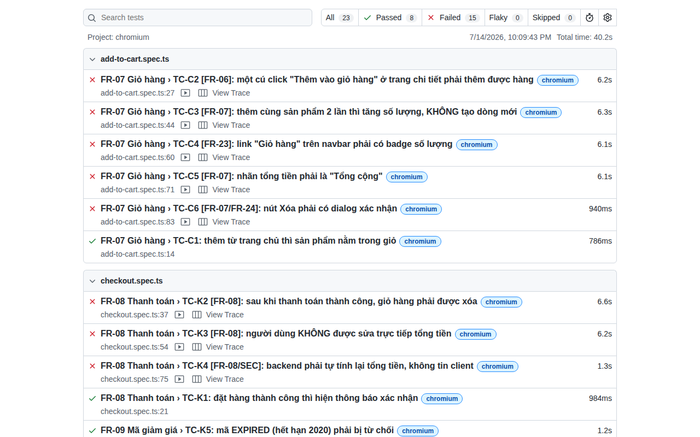

# User Guide — Playwright cho Web Automation Testing trên EShop

> **Môn học:** CS423 / CSC15003 — Software Testing · **Seminar:** T02 — Web Automation Testing
> **Nhóm:** 23KTPM1_02 — Đoàn Thành Phát (23127241), Lê Thiên Phú (23127244), Lý Quốc Thạnh (23127262), Nguyễn Đình Thái Hưng (23127373)
> **Công cụ truyền thống:** Playwright (TypeScript) · **Hướng AI:** AI coding assistant (Claude / Codex / GitHub Copilot Student)
> **SUT:** EShop — <https://github.com/ttbhanh/eshop-sut>
> **Ngày chạy thực tế các số liệu trong tài liệu này:** 14/07/2026 · Playwright 1.61.1 · Node 22.22.1 · Chromium (headless)

Toàn bộ số liệu, thông báo lỗi và ảnh chụp trong tài liệu này lấy từ **lần chạy thật trên máy nhóm**, không phải ví dụ bịa. Mã nguồn test kèm theo nằm trong thư mục [`eshop-e2e/`](eshop-e2e/).

---

## 1. Introduction

### 1.1. Bài toán

Kiểm thử web thủ công cho EShop có 3 vấn đề: chạy lại tốn thời gian, người test dễ bỏ sót bước, và khi lỗi xảy ra thì không có bằng chứng để lập trình viên tái hiện. Web automation testing giải quyết cả ba: kịch bản được mã hoá thành code, chạy lại trong vài giây, và mỗi lần fail đều để lại trace/screenshot/video.

**Playwright** là test framework của Microsoft điều khiển trình duyệt thật (Chromium/Firefox/WebKit) qua một API duy nhất. Ba đặc điểm khiến nhóm chọn nó cho EShop:

| Đặc điểm | Ý nghĩa với người kiểm thử |
|---|---|
| **Auto-wait** | Trước mỗi hành động, Playwright tự chờ phần tử *actionable* (hiện hữu, nhìn thấy được, ổn định, nhận được sự kiện). Không cần `sleep()` rải rác — nguồn cơn số một của flaky test. |
| **Web-first assertion** | `expect(locator).toBeVisible()` tự thử lại (retry) đến khi hết timeout, thay vì kiểm tra một lần rồi hỏng. |
| **Trace viewer** | Khi test fail, ta xem lại từng bước kèm DOM snapshot, network, console — không phải đoán mò. |

### 1.2. Tài liệu này dành cho ai

Sinh viên đã biết JavaScript/TypeScript cơ bản và muốn tự dựng bộ E2E test cho EShop từ con số 0. Không cần kinh nghiệm Playwright trước đó.

### 1.3. Điều bắt buộc phải hiểu trước khi đọc tiếp

**EShop là SUT được cố ý cài lỗi.** README của SUT nói rõ hệ thống "CỐ Ý được thiết kế chứa nhiều lỗi". Điều này thay đổi hoàn toàn cách viết test:

> **Nguyên tắc xuyên suốt: LOCATOR bám DOM thật — ASSERTION bám ĐẶC TẢ.**
>
> Ta phải *điều khiển* được ứng dụng như nó **đang là** (nên locator phải khớp DOM lỗi), nhưng phải *phán xét* nó theo ĐẶC TẢ (SRS) — cái nó **đáng lẽ phải là**. Trộn lẫn hai thứ này là sai lầm chết người: nếu assertion cũng bám theo DOM đang có, test sẽ xanh rờn và **hợp thức hoá mọi con bug**.

Một test **FAIL** trong bộ này thường có nghĩa là **SUT có defect**, không phải test viết sai. Mục 5 hướng dẫn cách phân biệt hai trường hợp đó.

---

## 2. Installation

### 2.1. Yêu cầu môi trường

- Node.js >= 18 (nhóm dùng **v22.22.1**), npm >= 9.
- ~400 MB đĩa cho binary Chromium.
- SUT EShop đã clone về máy.

### 2.2. Dựng SUT (EShop) — phải chạy trước khi test

EShop gồm backend (Express + SQLite) và frontend-web (React + Vite). Mở **2 terminal**:

```bash
# Terminal 1 — Backend API (mặc định http://localhost:3000)
cd eshop-sut/backend
npm install
node database.js      # seed CSDL — chỉ chạy lần đầu, hoặc khi muốn reset dữ liệu
node server.js        # -> "Server is running on http://localhost:3000"

# Terminal 2 — Frontend Web (http://localhost:5173)
cd eshop-sut/frontend-web
npm install
npm run dev           # -> "Local: http://localhost:5173/"
```

Tài khoản seed sẵn: `test@eshop.com` / `Test1234!` (user) và `admin@eshop.com` / `Admin123!` (admin).

> **Nếu port 3000 đã bị chiếm** (rất hay gặp — Next.js, Grafana… đều dùng port này): xem mục 5, lỗi #4. Nhóm đã phải chuyển backend sang `:3001` khi chạy thật.

### 2.3. Cài Playwright

```bash
mkdir eshop-e2e && cd eshop-e2e
npm init -y
npm install -D @playwright/test@latest
npx playwright install chromium        # tải browser binary
npx playwright --version               # -> Version 1.61.1
```

**Ghi chú theo hệ điều hành:**

| OS | Lưu ý |
|---|---|
| **Linux** | Lệnh khuyến nghị trong docs là `npx playwright install --with-deps`, nhưng nó **cần quyền root** để `apt-get install` thư viện hệ thống. Máy nhóm chạy không có TTY nên báo `sudo: A terminal is required to authenticate` → `Failed to install browsers`. Cách xử lý: chạy `npx playwright install chromium` (không có `--with-deps`); nếu browser thiếu thư viện thì chạy riêng `sudo npx playwright install-deps`. |
| **Windows / macOS** | `npx playwright install chromium` là đủ, không cần quyền admin. |
| **WSL** | Giống Linux; thêm `--with-deps` một lần duy nhất bằng `sudo`. |

### 2.4. Ảnh chụp — SUT đã chạy



Ảnh này chụp `http://localhost:5173/login` sau khi nhóm điền dữ liệu bằng Playwright. Hãy nhìn kỹ — nó là **bản cáo trạng** cho phần còn lại của tài liệu:

1. Tiêu đề trang đăng nhập ghi **"Đăng Ký"** (vi phạm FR-02).
2. Nhãn ô email ghi **"Username"**, không phải "Email" (vi phạm FR-22).
3. **Mật khẩu `Test1234!` hiện rõ nguyên văn** vì input là `type="text"` chứ không phải `type="password"` (vi phạm FR-22 + SEC).
4. Nút submit ghi **"Sign In"**, không phải tiếng Việt (vi phạm FR-21).
5. Link "Giỏ hàng" trên navbar **không có badge** số lượng (vi phạm FR-23).

Đây chính là lý do mọi locator "đẹp theo sách giáo khoa" (`getByLabel('Email')`) đều **chết** trên SUT này.

---

## 3. First Test — một luồng E2E hoàn chỉnh trên EShop

Mục tiêu: đăng nhập bằng `test@eshop.com`, xác nhận vào được trang chủ ở trạng thái đã đăng nhập. **13 bước.**

**Bước 1.** Tạo file cấu hình `playwright.config.ts`:

```ts
import { defineConfig, devices } from '@playwright/test';

export default defineConfig({
  testDir: './tests',
  fullyParallel: true,
  reporter: [['html', { open: 'never' }], ['list']],
  use: {
    baseURL: process.env.BASE_URL ?? 'http://localhost:5173',
    trace: 'retain-on-failure',      // giữ trace khi fail -> để điều tra
    screenshot: 'only-on-failure',
    video: 'retain-on-failure',
  },
  projects: [{ name: 'chromium', use: { ...devices['Desktop Chrome'] } }],
});
```

**Bước 2.** Trước khi viết locator, **hãy đi dò DOM thật** — đừng tin trí nhớ, cũng đừng tin đặc tả. Tạo `tests/probe.spec.ts`:

```ts
import { test } from '@playwright/test';

test('probe: DOM thật của trang login', async ({ page }) => {
  await page.goto('/login');
  console.log('số thẻ h1          :', await page.getByRole('heading', { level: 1 }).count());
  console.log('getByLabel(Username):', await page.getByLabel('Username').count());
  console.log('số textbox          :', await page.getByRole('textbox').count());
  console.log('các nút             :', await page.getByRole('button').allTextContents());
});
```

**Bước 3.** Chạy nó: `npx playwright test tests/probe.spec.ts`. Kết quả thật trên máy nhóm:

```
số thẻ h1          : 0
getByLabel(Username): 0        <-- LABEL KHÔNG DÙNG ĐƯỢC!
số textbox          : 2
các nút             : [ 'Sign In' ]
```

**Bước 4.** Đọc kết quả. `getByLabel('Username')` trả về **0 phần tử** dù mắt ta thấy rõ chữ "Username". Lý do: trong `Login.jsx`, thẻ `<label>` **không có `for`/`id`** và **không bọc** input, nên nó không phải là nhãn hợp lệ theo chuẩn accessibility. Playwright tuân thủ chuẩn, nên nó không tìm thấy gì cả. Cả 2 ô lại đều là `type="text"` nên cũng không phân biệt được bằng type.

**Bước 5.** Kết luận locator: SUT không có `data-testid` (nhóm đã `grep` toàn bộ `src/`: **0 kết quả**), không có label dùng được → buộc phải neo theo **vị trí trong form**. Đây là locator **yếu**, và sự yếu đó là *bằng chứng của defect*, không phải lựa chọn thiết kế tốt.

**Bước 6.** Tạo Page Object `pages/LoginPage.ts`:

```ts
import { Page, Locator, expect } from '@playwright/test';

export class LoginPage {
  readonly usernameInput: Locator;
  readonly passwordInput: Locator;
  readonly submitButton: Locator;
  readonly errorMessage: Locator;

  constructor(private page: Page) {
    const form = page.locator('form');
    // Bất đắc dĩ phải neo theo thứ tự: label hỏng, không có test-id, cả 2 ô đều type="text".
    this.usernameInput = form.getByRole('textbox').first();
    this.passwordInput = form.getByRole('textbox').nth(1);
    this.submitButton = page.getByRole('button', { name: 'Sign In' });
    this.errorMessage = page.getByText('Đăng nhập thất bại');
  }

  async goto() {
    await this.page.goto('/login');
    await expect(this.submitButton).toBeVisible();   // neo: trang đã render xong
  }

  async login(email: string, password: string) {
    await this.usernameInput.fill(email);
    await this.passwordInput.fill(password);
    await this.submitButton.click();
  }
}
```

**Bước 7.** Viết test `tests/login.spec.ts`:

```ts
import { test, expect } from '@playwright/test';
import { LoginPage } from '../pages/LoginPage';

test('TC-L1: đăng nhập đúng thì vào được trang chủ', async ({ page }) => {
  const loginPage = new LoginPage(page);
  await loginPage.goto();
  await loginPage.login('test@eshop.com', 'Test1234!');

  await expect(page).toHaveURL('http://localhost:5173/');
  // Oracle KHÔNG chỉ là URL: trang chủ vẫn hiện khi CHƯA đăng nhập.
  // Phải kiểm tra header đã đổi sang trạng thái đã-đăng-nhập.
  await expect(page.getByRole('button', { name: 'Thoát' })).toBeVisible();
});
```

**Bước 8.** Chú ý bước 7: chỉ `toHaveURL('/')` là **oracle yếu** — trang chủ hiển thị bình thường ngay cả khi đăng nhập thất bại, nên test vẫn xanh dù login hỏng. Phải khẳng định một dấu hiệu **chỉ tồn tại khi đã đăng nhập** (nút "Thoát" trong header).

**Bước 9.** Chạy test:

```bash
npx playwright test tests/login.spec.ts
```

**Bước 10.** Kết quả thật:

```
✓ 1 [chromium] › tests/login.spec.ts:10:7 › TC-L1: đăng nhập đúng thì vào được trang chủ (747ms)
  1 passed (1.4s)
```

**Bước 11.** Mở báo cáo HTML: `npx playwright show-report`.

**Bước 12.** Khi có test fail, mở trace để điều tra: `npx playwright show-trace test-results/<tên-test>/trace.zip`. Trace cho xem lại từng action kèm ảnh DOM trước/sau, network và console.

**Bước 13.** Xong luồng đầu tiên. Bộ test đầy đủ 3 flow (Login/lockout FR-02, Add-to-Cart FR-07, Checkout FR-08) nằm trong [`eshop-e2e/tests/`](eshop-e2e/tests/).

---

## 4. Advanced Usage

### 4.1. Fixture — mỗi test một tài khoản sạch

Test lockout làm **khoá** tài khoản. Nếu mọi test dùng chung `test@eshop.com`, test lockout sẽ làm hỏng các test khác chạy song song. Giải pháp: fixture tự tạo user mới qua API cho từng test ([`fixtures/test-fixtures.ts`](eshop-e2e/fixtures/test-fixtures.ts)):

```ts
export const test = base.extend<Fixtures>({
  api: async ({}, use) => {
    const ctx = await request.newContext({ baseURL: API_URL });
    await use(ctx);
    await ctx.dispose();
  },

  freshUser: async ({ api }, use, testInfo) => {
    const unique = `${Date.now()}-${testInfo.workerIndex}`;
    const user = { name: `E2E ${unique}`, email: `e2e-${unique}@eshop.test`, password: 'Test1234!' };
    await api.post('/api/register', { data: user });   // setup qua API: nhanh và ổn định
    await use(user);
  },
});
```

Nguyên tắc: **dữ liệu setup thì đi cửa API, hành vi cần kiểm thử thì đi cửa UI.** Đăng ký user qua UI cho mỗi test vừa chậm vừa dễ vỡ.

### 4.2. Đặt oracle ở đúng tầng — bài học đắt nhất của nhóm

UI của EShop nuốt mọi lỗi login thành **một câu chung chung** ("Đăng nhập thất bại. Vui lòng kiểm tra lại."), nên nhìn từ UI **không thể phân biệt** *sai mật khẩu* với *tài khoản bị khoá*. Muốn kiểm chứng FR-02 phải xuống tầng API:

```ts
test('TC-L4: mỗi lần sai chỉ tăng bộ đếm 1 đơn vị, chưa khoá sau 2 lần', async ({ api, freshUser }) => {
  const wrong = { email: freshUser.email, password: 'SaiMatKhau!' };

  expect((await api.post('/api/login', { data: wrong })).status()).toBe(401);
  expect((await api.post('/api/login', { data: wrong })).status()).toBe(401);

  // FR-02: chỉ khoá khi sai TỪ 3 LẦN. Sau 2 lần sai, mật khẩu đúng vẫn phải vào được.
  const good = await api.post('/api/login', {
    data: { email: freshUser.email, password: freshUser.password },
  });
  expect(good.status(), 'sau 2 lần sai, mật khẩu đúng vẫn phải đăng nhập được').toBe(200);
});
```

Test này **FAIL: Expected 200, Received 403** → phát hiện defect: `server.js:54` viết `user.login_attempts + 2` (tăng 2 mỗi lần sai) nên tài khoản bị khoá ngay **sau 2 lần** sai thay vì 3. Đây là loại bug mà test chỉ nhìn UI **vĩnh viễn không thấy**.

### 4.3. Chạy song song và đo flakiness

```bash
npx playwright test                      # song song, worker = số core/2
npx playwright test --workers=1          # tuần tự, để gỡ lỗi
npx playwright test --repeat-each=10     # đo flakiness: chạy mỗi test 10 lần
npx playwright test --retries=2          # cho phép thử lại (CI)
npx playwright test --ui                 # UI mode: chạy/xem/tua lại trực quan
npx playwright codegen http://localhost:5173   # ghi thao tác -> sinh code
```

**Số liệu flakiness thật của nhóm** (`--repeat-each=10`, Chromium, máy local):

| Test | Kết quả 10 lần | Flake rate |
|---|---|---|
| TC-C1 — thêm sản phẩm từ trang chủ vào giỏ | 10/10 pass (3.5s) | **0%** |
| TC-K1 — đặt hàng thành công | 10/10 pass (4.9s) | **0%** |

Không có `sleep()` nào trong bộ test. Độ ổn định này đến từ **auto-wait + web-first assertion**, không phải may mắn. Đây là luận điểm chính khi so sánh với Selenium (nơi phải tự quản lý `WebDriverWait`).

### 4.4. Tích hợp CI (GitHub Actions)

```yaml
name: E2E
on: [push, pull_request]
jobs:
  test:
    runs-on: ubuntu-latest
    steps:
      - uses: actions/checkout@v4
      - uses: actions/setup-node@v4
        with: { node-version: 22 }
      - run: npm ci
      - run: npx playwright install --with-deps chromium
      - name: Khởi động SUT
        run: |
          (cd eshop-sut/backend && npm ci && node database.js && node server.js &)
          (cd eshop-sut/frontend-web && npm ci && npm run dev &)
          npx wait-on http://localhost:5173 http://localhost:3000/api/products
      - run: npx playwright test
      - uses: actions/upload-artifact@v4
        if: always()                     # QUAN TRỌNG: fail vẫn phải giữ bằng chứng
        with:
          name: playwright-report
          path: playwright-report/
```

### 4.5. Dùng AI đúng cách (yêu cầu bắt buộc của seminar)

Quy trình nhóm áp dụng: **người viết kịch bản → AI sinh nháp → người audit → chạy thật → đối chiếu đặc tả.**

Prompt đã dùng với AI assistant:

```
Viết test Playwright cho FR-02 của EShop: người dùng đăng nhập bằng
test@eshop.com / Test1234!, sai mật khẩu 3 lần thì tài khoản bị khoá 30 giây.
```

AI trả về code trông rất chuẩn ([`tests/ai-draft/login-ai-draft.spec.ts`](eshop-e2e/tests/ai-draft/login-ai-draft.spec.ts) — nhóm **giữ nguyên, không sửa**, làm tang chứng):

```ts
await expect(page.getByRole('heading', { name: 'Đăng nhập' })).toBeVisible();
await page.getByLabel('Email').fill('test@eshop.com');
await page.getByLabel('Mật khẩu').fill('Test1234!');
await page.getByRole('button', { name: 'Đăng nhập' }).click();
```

Chạy thật → **FAIL toàn bộ**. AI viết test theo **đặc tả** (và theo thói quen của một trang login "bình thường"), trong khi DOM thật có heading "Đăng Ký", label không gắn `for`, nút ghi "Sign In".

**Bảng đối chiếu AI vs người viết:**

| Tiêu chí | AI draft (chưa audit) | Bản nhóm audit |
|---|---|---|
| Locator | `getByLabel('Email')` — khớp 0 phần tử | `form.getByRole('textbox').first()` — khớp DOM thật |
| Heading | Giả định "Đăng nhập" | Khẳng định defect: đang là "Đăng Ký" |
| Oracle login | Chỉ `toHaveURL('/')` (yếu — trang chủ luôn hiện) | Thêm `getByRole('button', {name:'Thoát'})` |
| Lockout | Chờ chữ "khoá" trên UI (UI không bao giờ hiện) | Kiểm ở tầng API: `status()` 401/403/200 |
| Số lần chỉnh sửa | — | **4/4 điểm phải sửa** |

Kết luận đưa vào slide: **AI tăng tốc việc gõ code, nhưng AI không phải test oracle.** AI không biết SUT có bug — nó cho rằng thế giới đúng như tài liệu mô tả. Nếu ai đó nhận code AI rồi "sửa cho xanh" bằng cách nới lỏng locator/assertion, họ sẽ **hợp thức hoá đúng những con bug cần tìm**.

---

## 5. Troubleshooting — 5 lỗi thật nhóm đã gặp

### Lỗi #1 — `locator.fill: Test timeout exceeded` khi dùng `getByLabel`

```
Error: locator.fill: Test timeout of 30000ms exceeded.
Call log:
  - waiting for getByLabel('Email')
```

**Nguyên nhân.** Không phải trang chậm. Locator khớp **0 phần tử** và Playwright kiên nhẫn chờ cho đến hết 30s. Trên EShop, `<label>Username</label>` không có `for`/`id` và không bọc input → không phải nhãn hợp lệ → `getByLabel` không thấy gì. (Ngoài ra AI còn dò chữ "Email" trong khi nhãn thật là "Username".)

**Cách sửa.** Luôn dò DOM trước bằng `.count()` (Bước 2–3 mục 3) trước khi tin vào locator. Nếu `count() === 0` thì đó là lỗi locator, không phải lỗi timing — **nới timeout sẽ không bao giờ cứu được**.

### Lỗi #2 — Giỏ hàng rỗng dù vừa bấm "Thêm vào giỏ" (test của nhóm sai, không phải SUT sai)

```
Error: expect(locator).toHaveCount(expected) failed
Locator: locator('tbody tr').filter({ hasText: 'iPhone 15 Pro Max' })
Expected: 1
Received: 0
```

**Nguyên nhân.** Nhóm dùng `page.goto('/cart')` để sang giỏ hàng. Giỏ hàng của EShop nằm trong React state (`CartContext` dùng `useState`, **không** persist xuống `localStorage`). Mọi **hard navigation** (`goto`, F5) đều **reset state về rỗng**. Test đã "phát hiện" một con bug không hề tồn tại.

**Cách sửa.** Sau khi thêm hàng, phải điều hướng bằng **click vào link** (SPA routing giữ nguyên state):

```ts
async openFromNavbar() {
  await this.page.getByRole('link', { name: 'Giỏ hàng' }).click();
  await this.page.waitForURL('**/cart');
}
```

**Bài học:** khi test SPA fail, câu hỏi đầu tiên luôn là *"mình có vô tình reload trang không?"* — trước khi kết luận SUT có bug.

### Lỗi #3 — `strict mode violation ... resolved to 2 elements`

```
Error: strict mode violation: getByRole('heading', { level: 1 }) resolved to 2 elements:
    1) <h1 class="text-3xl font-bold">Danh sách sản phẩm</h1>
    2) <h1 class="text-center text-gray-400 mt-8 text-sm">Hiển thị 5 sản phẩm</h1>
```

**Nguyên nhân.** Playwright bật *strict mode* mặc định: một locator khớp >1 phần tử thì **báo lỗi thay vì đoán bừa**. Trang chủ EShop có **2 thẻ `<h1>`**, vi phạm FR-05 ("Trang chủ chỉ có đúng một thẻ `<h1>`").

**Cách sửa — và một cái bẫy.** Phản xạ tự nhiên là thêm `.first()` cho hết đỏ. **Đừng.** Làm vậy là bịt miệng công cụ vừa tố cáo đúng một defect. Cách đúng: viết hẳn một assertion tố cáo nó, rồi thu hẹp locator theo ngữ nghĩa ở những chỗ khác:

```ts
await expect(page.getByRole('heading', { level: 1 }), 'FR-05: chỉ được có 1 thẻ h1').toHaveCount(1);
await expect(page.getByRole('heading', { name: 'Danh sách sản phẩm' })).toBeVisible();
```

### Lỗi #4 — Backend không chạy được: port 3000 đã bị chiếm

Triệu chứng: `node server.js` in ra "Server is running…" rồi tiến trình chết, hoặc frontend gọi API trả HTML lạ của app khác. Kiểm tra:

```bash
ss -ltnp | grep :3000     # Linux
netstat -ano | findstr :3000   # Windows
```

**Cách sửa.** Nhóm gặp đúng ca này (một app Next.js đang giữ `:3000`). Đổi backend sang port khác — cần sửa **cả hai phía** vì SUT hardcode URL:

```bash
# backend/server.js: const PORT = process.env.PORT || 3000;
PORT=3001 node server.js
# frontend-web/src: đổi mọi 'http://localhost:3000' -> 'http://localhost:3001' (13 chỗ)
# rồi chạy test với:
API_URL=http://localhost:3001 npx playwright test
```

### Lỗi #5 — `npx playwright install --with-deps` thất bại

```
Switching to root user to install dependencies...
sudo: A terminal is required to authenticate
Failed to install browsers
Error: Installation process exited with code: 1
```

**Nguyên nhân.** `--with-deps` gọi `apt-get` để cài thư viện hệ thống → cần quyền root + TTY.

**Cách sửa.** Bỏ `--with-deps`: `npx playwright install chromium`. Nếu Chromium khởi động lỗi vì thiếu `.so`, chạy riêng `sudo npx playwright install-deps` trong terminal có TTY.

---

## 6. Failure Modes — 5 cách Playwright (và AI) **đánh lừa** bạn

Đây là mục quan trọng nhất của tài liệu. Công cụ tốt không có nghĩa là kết quả đáng tin.

### FM-1. Assertion "vắng mặt" KHÔNG được auto-wait bảo vệ → **test xanh giả**

Ai cũng tin "Playwright có auto-wait nên khỏi lo timing". **Sai.** `toHaveCount(0)` và `not.toBeVisible()` được thoả mãn **ngay ở lần poll đầu tiên** — tức là ở thời điểm SPA còn **chưa kịp render trang mới**. Không có gì để chờ, nên nó "đúng" ngay lập tức.

Nhóm chứng minh bằng thí nghiệm đối chứng ([`tests/false-pass-demo.spec.ts`](eshop-e2e/tests/false-pass-demo.spec.ts)) — **cùng một yêu cầu FR-08, cùng một SUT, chỉ khác đúng một dòng neo trạng thái**:

```ts
// ❌ XANH GIẢ — assert ngay sau click, lúc /checkout chưa render
await cart.checkoutButton.click();
await expect(page.locator('input[type="number"]')).toHaveCount(0);   // ✓ passed (949ms)

// ✅ ĐỎ ĐÚNG — neo trạng thái trước rồi mới assert
await cart.checkoutButton.click();
await expect(page.getByRole('button', { name: 'Xác Nhận Thanh Toán' })).toBeVisible();  // NEO
await expect(page.locator('input[type="number"]')).toHaveCount(0);   // ✘ failed: Expected 0, Received 1
```

Kết quả chạy thật: **1 passed, 1 failed**. Bản "xanh" **bỏ lọt** defect FR-08 (tổng tiền thanh toán là input sửa được).

**Và đây mới là phần đáng sợ nhất.** Nhóm chạy lại chính 2 test đó với `--repeat-each=10`:

| Cách viết | 10 lần chạy | Diễn giải |
|---|---|---|
| Không neo (kiểu AI hay sinh) | **2 xanh / 8 đỏ** | *Flaky.* Mỗi lần xanh là một lần defect FR-08 được cấp chứng chỉ "đã kiểm thử" |
| Có neo trạng thái | **0 xanh / 10 đỏ** | Ổn định tuyệt đối, luôn tố cáo đúng defect |

Test không neo **không phải lúc nào cũng nói dối** — nó nói dối **20% số lần**. Đó chính là lý do loại lỗi này sống sót lâu đến vậy: chạy trên máy dev (nhanh) thì đỏ, chạy trên CI đang tải nặng (chậm) thì có khi xanh, và người ta kết luận "chắc do CI dở hơi". Một test flaky đang xanh còn nguy hiểm hơn một test đỏ, vì không ai đi điều tra màu xanh.

> **Quy tắc:** trước mọi assertion phủ định, phải **neo** vào một phần tử *chắc chắn tồn tại* của trạng thái đích. Nếu không, bạn chỉ đang khẳng định "trang cũ không có thứ đó" — một sự thật vô nghĩa.
>
> **Cách tự kiểm tra:** chạy `--repeat-each=10`. Test nào lúc xanh lúc đỏ là test đang nói dối bạn — kể cả, và nhất là, khi nó đang xanh.

### FM-2. Auto-wait và retry có thể **che giấu lỗi UX thật**

Nút "Thêm vào giỏ hàng" ở trang chi tiết sản phẩm **phải bấm 2 lần** mới có tác dụng (`ProductDetail.jsx` nuốt cú click đầu tiên bằng biến `clickCount`). Test đúng chỉ bấm **1 lần** và **FAIL** — tố cáo đúng defect FR-06.

Nhưng phản xạ của rất nhiều người khi thấy test đỏ là "chắc do timing" rồi **bấm thêm lần nữa cho chắc**, hoặc thêm `waitForTimeout(1000)` rồi click lại. Test xanh ngay. **Và con bug biến mất khỏi báo cáo.** Người dùng thật vẫn phải bấm 2 lần mỗi ngày.

Nhóm đã **thử đúng kịch bản đó** thay vì chỉ cảnh báo suông. Đưa nguyên log lỗi TC-C2 cho AI assistant kèm câu hỏi *"vì sao fail, sửa giúp"*, AI giải thích rất thuyết phục rằng đây là vấn đề timing/hydration của React và đề xuất click thêm một lần. Bản sửa đó được giữ nguyên trong [`tests/ai-fix-hides-bug.spec.ts`](eshop-e2e/tests/ai-fix-hides-bug.spec.ts):

```ts
await addButton.click();
await addButton.click();          // "fix" do AI đề xuất
await cart.openFromNavbar();
await expect(cart.row(PRODUCT)).toHaveCount(1);
```

Chạy thật:

```
✓ BẢN SỬA CỦA AI (xanh nhưng che mất defect FR-06) (691ms)
  1 passed
```

Suite sạch bong, report toàn màu xanh, và DEF-04 — *người dùng thật bấm một lần thì không có gì vào giỏ* — **biến mất hoàn toàn khỏi báo cáo**. Không một dòng cảnh báo nào.

> **Quy tắc:** không bao giờ thêm hành động (click lại, chờ thêm) chỉ để "cho test xanh". Với mọi bản sửa AI đề xuất, bắt buộc trả lời một câu trước khi merge: **"Cái này sửa TEST hay sửa SUT?"** Nếu bản sửa buộc test phải mô phỏng hành vi mà người dùng thật không bao giờ làm (ai lại bấm "Thêm vào giỏ" hai lần?), thì đó không phải fix — đó là che lỗi.
>
> Và đừng bao giờ dán log lỗi cho AI kèm câu *"sửa giúp"*. Hãy hỏi: *"Test này fail. Liệt kê mọi giả thuyết, và chỉ rõ giả thuyết nào hàm ý **sản phẩm** có lỗi."*

### FM-3. UI xanh, nghiệp vụ hỏng — oracle đặt sai tầng

Test TC-K4: nhóm sửa ô tổng tiền từ 30.000.000 ₫ xuống **1.000 ₫** ngay trên trình duyệt rồi bấm thanh toán. UI hiện to đùng **"Thanh toán thành công!"**. Nếu oracle chỉ nhìn UI (đúng như bản AI draft làm) → **test XANH**.

Nhóm đặt oracle ở tầng **dữ liệu**, hỏi thẳng API đơn hàng vừa tạo:

```
Error: backend không được nhận tổng tiền do client gửi
Expected: 30000000
Received: 1000
```

Backend **thật sự** đã ghi đơn 30 triệu với giá 1.000 ₫ (vi phạm FR-08 + SEC). Đây là lỗ hổng bảo mật nghiêm trọng mà **mọi test chỉ-nhìn-UI đều mù tịt**.

> **Quy tắc:** hỏi "**bằng chứng nào chứng minh nghiệp vụ đã đúng?**", không phải "màn hình có hiện chữ thành công không?".

### FM-4. AI sinh test theo **đặc tả**, không theo **hiện thực** → đỏ giả rồi dẫn tới xanh giả

Bản AI draft fail 100% vì bám theo thế giới lý tưởng (`getByLabel('Email')`, heading "Đăng nhập", nút "Đăng nhập"). Bản thân việc đỏ thì vô hại. **Nguy hiểm nằm ở bước tiếp theo:** người dùng thiếu kinh nghiệm sẽ dán lỗi cho AI sửa, AI sẽ ngoan ngoãn "sửa cho khớp DOM" — đổi assertion heading thành `'Đăng Ký'`, đổi nút thành `'Sign In'`, và **thế là bộ test chính thức công nhận các con bug là hành vi đúng.** Test xanh, báo cáo đẹp, SUT vẫn hỏng.

> **Quy tắc:** khi test đỏ, phải phân định *"DOM khác đặc tả"* (→ **defect của SUT**, ghi vào bug report) hay *"test viết sai"* (→ sửa test). **Chỉ được sửa locator, tuyệt đối không nới assertion.**

### FM-5. Bằng chứng chỉ được lưu khi FAIL

Cấu hình `trace: 'retain-on-failure'` (và `screenshot: 'only-on-failure'`) nghĩa là **test xanh không để lại gì cả**. Một test xanh giả (FM-1) sẽ trôi qua **hoàn toàn im lặng** — không ảnh, không trace, không ai xem lại.

Tệ hơn: `--retries=2` trên CI khiến một test flaky fail-rồi-pass được đánh dấu **"flaky"** và pipeline vẫn **xanh**. Bug thật có thể ẩn dưới nhãn "flaky" hàng tháng trời.

> **Quy tắc:** với các luồng trọng yếu (thanh toán, phân quyền), bật `trace: 'on'` để có bằng chứng **kể cả khi xanh**; và **luôn mở tab "Flaky"** trong HTML report thay vì chỉ nhìn màu xanh tổng thể.

---

## 7. Tổng hợp kết quả chạy thật & defect phát hiện được

Lần chạy đầy đủ ngày 14/07/2026 (`npx playwright test`, Chromium, 40.2s):



**23 test — 8 passed — 15 failed.** Mọi test đỏ đều truy ngược về một defect thật của SUT:

| Test | Defect phát hiện | Vi phạm |
|---|---|---|
| TC-L3 | Ô mật khẩu là `type="text"` → mật khẩu hiện rõ trên màn hình | FR-22, SEC |
| TC-L4 | Sai 1 lần nhưng bộ đếm tăng **2** (`login_attempts + 2`) → khoá ngay sau **2** lần sai | FR-02 |
| TC-L5 | Khoá **180 giây** thay vì 30 giây | FR-02 |
| TC-C2 | Nút "Thêm vào giỏ hàng" ở trang chi tiết phải bấm **2 lần** mới ăn | FR-06 |
| TC-C3 | Thêm cùng sản phẩm 2 lần → tạo **2 dòng** thay vì gộp số lượng | FR-07 |
| TC-C4 | Navbar "Giỏ hàng" **không có badge** số lượng | FR-23 |
| TC-C5 | Nhãn tổng tiền ghi "Tổng tạm tính" thay vì "Tổng cộng" | FR-07 |
| TC-C6 | Nút "Xóa" **không có dialog xác nhận** — xoá thẳng tay | FR-07, FR-24 |
| TC-K2 | Sau thanh toán thành công, **giỏ hàng không được xoá** | FR-08 |
| TC-K3 | Tổng tiền thanh toán là `<input type="number">` — **người dùng sửa được** | FR-08 |
| TC-K4 | **Backend chấp nhận `total_amount` do client gửi** → mua iPhone 30 triệu với giá 1.000 ₫ | FR-08, SEC |
| AI draft (2 test) | Không phải bug SUT — bug của test do AI sinh (xem FM-4) | — |

---

## 8. References

Mọi link đều đã được nhóm truy cập và đối chiếu trực tiếp (không trích qua trí nhớ của AI).

1. Playwright — Auto-waiting / Actionability: <https://playwright.dev/docs/actionability>
2. Playwright — Locators (và triết lý ưu tiên locator hướng người dùng): <https://playwright.dev/docs/locators>
3. Playwright — Strict mode: <https://playwright.dev/docs/locators#strictness>
4. Playwright — Assertions (web-first, auto-retrying): <https://playwright.dev/docs/test-assertions>
5. Playwright — Trace Viewer: <https://playwright.dev/docs/trace-viewer-intro>
6. Playwright — Fixtures: <https://playwright.dev/docs/test-fixtures>
7. Playwright — Page Object Models: <https://playwright.dev/docs/pom>
8. Playwright — Parallelism & sharding: <https://playwright.dev/docs/test-parallel>
9. Playwright — Continuous Integration: <https://playwright.dev/docs/ci>
10. Playwright — Best Practices: <https://playwright.dev/docs/best-practices>
11. Playwright — Test retries & flaky tests: <https://playwright.dev/docs/test-retries>
12. Playwright — API testing (`request` fixture): <https://playwright.dev/docs/api-testing>
13. GitHub Copilot — Writing tests: <https://docs.github.com/en/copilot/tutorials/write-tests>
14. GitHub Copilot — Responsible use of agents: <https://docs.github.com/en/copilot/responsible-use/agents>
15. Bach, J. — *Test Automation Snake Oil* (1999): <https://www.satisfice.com/download/test-automation-snake-oil>
16. EShop SUT — SRS (FR-01…FR-24, SEC-01…SEC-07) và `setup_guide.md`: <https://github.com/ttbhanh/eshop-sut>

---

## Phụ lục — Cấu trúc mã nguồn kèm theo

```
eshop-e2e/
├── playwright.config.ts              # baseURL, trace/screenshot/video, reporter
├── fixtures/test-fixtures.ts         # fixture: api + freshUser (mỗi test 1 user sạch)
├── pages/                            # Page Object Model
│   ├── LoginPage.ts                  #   kèm ghi chú vì sao locator buộc phải yếu
│   ├── HomePage.ts
│   ├── CartPage.ts                   #   openFromNavbar(): tránh bẫy reset state (lỗi #2)
│   └── CheckoutPage.ts
├── tests/
│   ├── probe.spec.ts                 # dò DOM thật trước khi viết locator
│   ├── login.spec.ts                 # FR-02: login + lockout
│   ├── add-to-cart.spec.ts           # FR-06/FR-07/FR-23: giỏ hàng
│   ├── checkout.spec.ts              # FR-08/FR-09: thanh toán + coupon
│   ├── false-pass-demo.spec.ts       # bằng chứng cho FM-1 (xanh giả vs đỏ đúng)
│   ├── ai-fix-hides-bug.spec.ts      # bằng chứng cho FM-2 (bản "fix" của AI: xanh mà che bug)
│   └── ai-draft/login-ai-draft.spec.ts  # bản AI sinh, GIỮ NGUYÊN làm tang chứng (FM-4)
├── tools/capture-docs-screenshots.mjs
└── docs/screenshots/                 # ảnh dùng trong tài liệu này
```

Chạy lại toàn bộ:

```bash
# 1. Bật SUT (2 terminal, xem mục 2.2)
# 2. Chạy test
cd eshop-e2e
npx playwright test                    # nếu backend ở :3001 -> thêm API_URL=http://localhost:3001
npx playwright show-report
```
